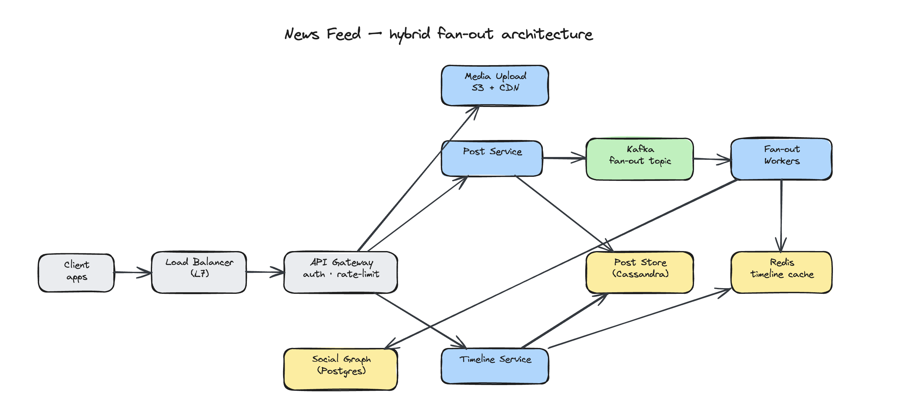

<h1 align="center">swe-interview-coach</h1>
<p align="center">Turn Claude Code into your SWE interview coach — behavioral, system design & coding mocks, all local.</p>

<p align="center">
  <a href="LICENSE"></a>
  
  
</p>

## Get started in 10 seconds

```
/plugin marketplace add kirilxd/swe-interview-coach
/plugin install swe-interview-coach@kirilxd-plugins
```

Then open Claude Code in your interview-prep directory (e.g., `~/Documents/interview/`) and run:

```
/story-add ~/Documents/your-resume.pdf
```

## What it does

Builds a canonical bank of STAR stories from your résumé or experience, maps them to each company you're targeting (with their values and JD), runs realistic mock interviews, drills story delivery, and captures learnings from real interviews. Everything is plain markdown in your working directory — you can edit anything in `vim` and the plugin still works.

## Interview modes

| Mode | Status | What it covers |
|---|---|---|
| **Behavioral** | ✅ Available | STAR story bank, company-tailored mocks, delivery rehearsal, real-interview debriefs |
| **System Design** | ✅ Available | Canonical design walkthroughs, mock + practice on a shared local Excalidraw canvas (you draw, the agent draws — live in your browser), real-interview debriefs |
| **Coding** | ✅ Available | DSA pattern walkthroughs, guided practice + graded mocks with a local test harness that runs your code, rapid drills, real-interview debriefs, optional LeetCode import |
| **Take-home** | 🚧 Planned | Spec-scoping interview, pre-submission review against rubric |

The data layout under `~/Documents/interview/` is designed for these modes from day one — adding a `take-home/` subtree later requires no migration.

## Behavioral commands

| Command | What it does | Example |
|---|---|---|
| `/story-add [resume]` | Extract a STAR story; cold mode or CV-grounded if you pass a PDF | `/story-add ~/cv.pdf` |
| `/story-import <file>` | One-shot migration of legacy STAR-stories markdown | `/story-import <company_name>-stories.md` |
| `/story-map <company> [jd]` | Tailor every canonical story to a company and JD; cache company values | `/story-map <company_name> <url>` |
| `/mock-behavioral <company> [job-title]` | Realistic 5–7 question mock; scored debrief | `/mock-behavioral <company_name>` |
| `/story-rehearse <id> [variant]` | Drill one variant for filler, ramble, metrics, pronoun discipline | `/story-rehearse <company_name>-ui-library platform-driving-adoption` |
| `/debrief <company> [job-title]` | Post-real-interview capture; updates question bank with new gaps | `/debrief <company_name>` |

## Sysdesign commands

| Command | What it does | Example |
|---|---|---|
| `/sysdesign-explain <design>` | Canonical senior-engineer walkthrough; the agent builds the diagram on the canvas as it teaches | `/sysdesign-explain twitter-feed` |
| `/practice-sysdesign [design]` | Guided, untimed practice; the agent scribes your described architecture, hints freely | `/practice-sysdesign url-shortener` |
| `/mock-sysdesign [design]` | Graded 45-min mock; you draw, the agent probes, then scores a 6-axis rubric + annotates your diagram | `/mock-sysdesign uber-dispatch` |
| `/debrief-sysdesign <company> [topic]` | Capture a real interview afterward — problem, approach, stuck points, gut outcome | `/debrief-sysdesign <company_name> rate-limiter` |
| `/sysdesign-canvas` | Manually (re)start the canvas + open the browser tab (rarely needed) | `/sysdesign-canvas` |

### How the canvas works

<p align="center">
  
</p>

The first sysdesign command you run boots a tiny bundled Node-stdlib server (`scripts/canvas-server.js`) on http://localhost:9999 and opens a browser tab. Excalidraw loads once from a pinned CDN (esm.sh) and is then browser-cached — only the first load needs internet. The scene syncs **both directions** through one local JSON file, `~/.config/swe-interview-coach/canvas.json`: the agent's writes appear in your browser within ~500 ms, and your edits post back within ~300 ms. Roles shift per mode — **explain:** the agent draws; **practice:** the agent scribes and you can edit alongside it; **mock:** you draw while the agent observes, then annotates afterward. Prerequisites are just `node`, `lsof`, and a browser. There is **no MCP, no `npm install`, and no `/reload-plugins`** — the script is plain Node standard library.

## Coding commands

| Command | What it does | Example |
|---|---|---|
| `/coding-explain <pattern>` | Canonical senior-engineer walkthrough of a DSA pattern, worked on a representative problem | `/coding-explain sliding-window` |
| `/practice-coding [problem]` | Guided, untimed practice; seeds `solution.py` you edit in your own editor, hints freely | `/practice-coding two-sum` |
| `/mock-coding [problem]` | Graded mock; you code in `solution.py`, the coach probes, runs it against the bundled cases, then scores | `/mock-coding coin-change` |
| `/coding-drill <pattern>` | Rapid-fire reps on a pattern (or your weak patterns); recall, complexity, edge cases | `/coding-drill dynamic-programming` |
| `/debrief-coding <company> [problem]` | Capture a real coding interview afterward — problem, approach, stuck points, gut outcome | `/debrief-coding <company_name> two-sum` |
| `/coding-import <leetcode-url \| slug \| daily>` | Import a public LeetCode problem into your local library via a read-only fetch; becomes a normal practice/mock problem | `/coding-import two-sum` |

### How the test harness works

A practice or mock session seeds a `solution.py` in the session folder; you edit it in your own editor (vim, VS Code, whatever). On a mock, the coach runs your solution against the problem's bundled test cases through a tiny bundled Python-stdlib runner (`scripts/run-solution.sh` → `scripts/harness/python_runner.py`) and scores correctness from the result. The only prerequisite is **`python3` on your PATH**; if it isn't available the harness degrades gracefully to a read-only review of your code — coaching never aborts over a missing runtime. There is **no MCP, no `npm install`, and no server** — it's plain Python standard library that runs entirely on your machine.

## The behavioral prep loop

```
build → map → mock → drill → debrief → repeat
```

1. **Build your bank** — `/story-add` (with résumé) or `/story-import` (from existing notes). Each story can have multiple framings ("variants") tuned to different question themes.
2. **Map for the target** — `/story-map <company_name> <jd-url>` researches <company_name>'s values, fetches the JD, tailors every story, and builds a question index with coverage gaps.
3. **Mock it** — `/mock-behavioral <company_name>` runs an interview as a <company_name> engineer. Asks 5–7 questions with follow-ups. Scores STAR clarity, metric quality, conciseness, and values alignment on a 1–5 rubric.
4. **Drill the weak spots** — `/story-rehearse <id> <variant>` for delivery polish. The mock's coach notes tell you exactly which variants to drill.
5. **Debrief after real interviews** — `/debrief <company_name>` captures the actual questions asked, what stories you told, what surprised you. New questions feed back into the bank for next time.

## The sysdesign prep loop

```
explain → practice → mock → debrief → repeat
```

1. **Learn the pattern** — `/sysdesign-explain twitter-feed` walks you through a canonical design senior-engineer style, drawing the architecture on the canvas as it teaches.
2. **Practice untimed** — `/practice-sysdesign url-shortener` lets you talk through an architecture while the agent scribes your boxes and arrows and hints freely whenever you're stuck.
3. **Mock under pressure** — `/mock-sysdesign uber-dispatch` runs a graded 45-minute mock: you drive the diagram, the agent probes, then scores a 6-axis rubric and annotates your canvas.
4. **Debrief after real interviews** — `/debrief-sysdesign <company_name> rate-limiter` captures the actual problem, your approach, where you got stuck, and your gut on the outcome.

## The coding prep loop

```
explain → practice → mock → drill → debrief → repeat
```

1. **Learn the pattern** — `/coding-explain sliding-window` walks you through a DSA pattern senior-engineer style, worked on a representative problem so you internalize the shape, not just one answer.
2. **Practice untimed** — `/practice-coding two-sum` seeds a `solution.py` you edit in your own editor while the coach guides you and hints freely whenever you're stuck.
3. **Mock under pressure** — `/mock-coding coin-change` runs a graded mock: you code in `solution.py`, the coach probes, then runs your code against the bundled cases and scores correctness, complexity, and communication.
4. **Drill the weak spots** — `/coding-drill dynamic-programming` runs rapid-fire reps on a pattern; with no argument it targets the patterns your mocks flagged as weak.
5. **Debrief after real interviews** — `/debrief-coding <company_name> two-sum` captures the actual problem, your approach, where you got stuck, and your gut on the outcome.

## Your data stays local

All state lives in your working directory (typically `~/Documents/interview/`). No hidden home directory, no JSON, no database.

```
~/Documents/interview/
├── behavioral/
│   ├── stories/                          # canonical STAR bank (cross-company)
│   │   └── <company_name>-ui-library.md
│   └── rehearsals/                       # canonical drill sessions
├── sysdesign/
│   └── sessions/                         # cross-company practice & mock runs
│       ├── 2026-06-13-mock-sysdesign/    # transcript.md + canvas.excalidraw + canvas-annotated.excalidraw
│       └── 2026-06-13-practice-sysdesign/ # transcript.md + canvas.excalidraw
├── coding/
│   ├── sessions/                         # cross-company practice & mock runs
│   │   ├── 2026-06-13-mock-coding/       # solution.py + transcript.md (with rubric)
│   │   └── 2026-06-13-practice-coding/   # solution.py + transcript.md
│   ├── drills/                           # rapid-fire pattern reps
│   │   └── 2026-06-13-drill-dynamic-programming.md
│   ├── imported/                         # /coding-import'ed LeetCode problems
│   │   └── two-sum.md
│   └── weak-patterns.md                  # rolling tracker of flagged patterns
├── <company_name>/
│   ├── values.md                         # cached company culture/values
│   ├── jds/
│   │   └── senior-fe-engineer.md         # JDs you've prepped for
│   ├── behavioral/
│   │   ├── mapped-stories/
│   │   │   └── senior-fe-engineer/       # company-tailored variants
│   │   └── sessions/                     # mocks, mapped rehearsals, debriefs
│   ├── sysdesign/
│   │   └── sessions/
│   │       └── 2026-06-13-debrief-sysdesign.md
│   └── coding/
│       └── sessions/
│           └── 2026-06-13-debrief-coding.md
└── <company_name>/
    └── (same per-company structure)
```

Markdown with YAML frontmatter throughout. The `coding/` mode now sits alongside `behavioral/` and `sysdesign/` under each company directory the same way; `take-home/` will slot in later with no migration.

## Privacy

- Everything stays on your machine. No data is sent to external services beyond the standard Claude Code conversation.
- Company values caches use `WebSearch` and `WebFetch` for the same company-facing pages a human would Google.
- Your résumé is read locally via Claude's Read tool; only excerpts you discuss are processed.
- The sysdesign canvas runs entirely on `localhost:9999` via a bundled stdlib Node script; scene state lives in `~/.config/swe-interview-coach/canvas.json` and never leaves your machine. The Excalidraw library is fetched once from a pinned esm.sh CDN and then cached, and canvas exports save into your working dir's session folders.
- The coding test harness runs your code locally via a bundled Python stdlib script; nothing is sent anywhere. It executes code **without a sandbox** (full local filesystem/network access), so only run solutions you trust — this is your own code on your own machine. `/coding-import` is the only coding command that reaches the network, doing a read-only public fetch (`WebFetch`) of a LeetCode problem page — no login, no submission.

## Local development

```bash
claude --plugin-dir ~/Documents/swe-interview-coach
```

After editing any command, agent, or skill file, run `/reload-plugins` in your session.

## Uninstalling

```
/plugin uninstall swe-interview-coach@kirilxd-plugins
/plugin marketplace remove kirilxd-plugins
```

To remove your interview data: `rm -rf ~/Documents/interview/` (and any per-company subdirs you've created).

## License

MIT
