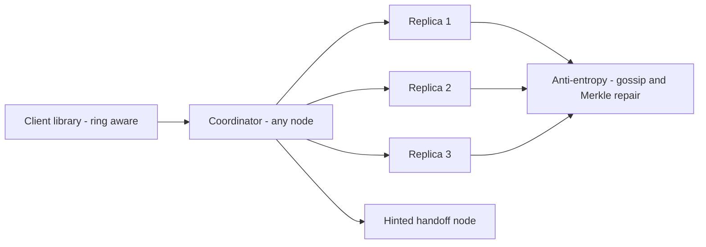

# Distributed Key-Value Store

## Requirements

**Functional (v1)**

- `get(key)`, `put(key, value, context)`, `delete(key)`; values up to 1 MB; namespaced buckets with per-bucket configuration.
- Tunable consistency per operation (R and W), plus single-key conditional put (CAS via version context).
- Explicitly not offered: multi-key transactions, secondary indexes, scans. Say so up front — scope discipline is part of the answer.

**Non-functional**

- 1M ops/s aggregate (700K reads / 300K writes), ~1 KB values, 100 TB logical data.
- p99 read < 10 ms, p99 write < 15 ms intra-DC.
- **Always writable:** 99.99% write availability through node failures and partitions — this is the requirement that forces a leaderless, AP-leaning design where reads may return possibly stale data, reconciled later.
- Durability: an acked write survives any single node loss (so W ≥ 2 by default).
- Incremental scale: add one node, get ~1/N more capacity, with bounded data movement.

## Capacity estimation

- Raw storage: `100 TB × N=3 replicas = 300 TB`. On 50 nodes with 8 TB usable NVMe each = 400 TB → 75% target utilization at steady state.
- Replica-level ops — the number people forget to multiply: writes `300K × 3 replicas = 900K/s`; reads at R=2 `700K × 2 = 1.4M/s`; total ≈ `2.3M replica ops/s ÷ 50 nodes ≈ 46K ops/s/node`. Comfortable for an LSM engine on NVMe (memtable absorbs writes; bloom filters keep most point reads to ≤ 1 SSD probe ≈ 0.1 ms; row cache serves hot keys from RAM at ~100 ns).
- Ring layout: 128 vnodes/node → 6,400 ring positions; keeps per-node load variance within ~±10% and makes rebalancing granular.
- Adding node #51 moves `300 TB / 51 ≈ 5.9 TB`; throttled at 500 MB/s that is ≈ 3.3 hours of background streaming — bounded reshuffle, versus mod-N hashing reshuffling nearly everything.
- Gossip convergence: 1 s rounds, fanout 3 → a membership rumor reaches all 50 nodes in ~4 rounds (3⁴ = 81 > 50) ≈ ~5 s worst case.
- Latency budget against the p99 target: client → coordinator ~0.5 ms + parallel replica fan-out ~0.5 ms + storage probe (row-cache hit in RAM ~100 ns; bloom-filtered SSD point read ~0.1 ms) → p50 ≈ 1–2 ms, leaving the 10 ms p99 to absorb slowest-of-R tails and compaction interference.

## High-level architecture



- Every node is a peer — storage node, coordinator, and gossip participant; there is no master and no external config service to lose.
- The ring-aware client library hashes the key and sends the request to a node in its preference list (saving a forwarding hop); any node can coordinate by forwarding if hit cold.
- The coordinator fans the operation to the N=3 preference-list replicas and answers when the bucket's R or W threshold is met; if a replica is down, a substitute node takes the write with a hint (sloppy quorum).
- In the background: gossip maintains membership and failure suspicion; read repair and Merkle-tree anti-entropy pull replicas back into agreement.

## API design

```
GET /v1/buckets/{b}/keys/{k}?r=2
  200: { "value": ..., "context": "<opaque version vector>" }
  300: { "siblings": [v1, v2], "context": "<merged context>" }   // concurrent versions

PUT /v1/buckets/{b}/keys/{k}?w=2
  Headers: X-Version-Context: <context from prior read>
  200: { "context": "<new context>" }

DELETE /v1/buckets/{b}/keys/{k}        // writes a tombstone, same quorum rules
PUT /v1/buckets/{b}                    // per-bucket config: n, default r/w, resolution=clocks|lww
```

- The version context is opaque to clients but mandatory on writes: it is how the store distinguishes "overwrite of what you read" from "concurrent with what someone else wrote".
- A 300 response with siblings is the API being honest about concurrency — callers of clock-resolved buckets must handle it (merge and write back). LWW buckets never return siblings.
- CAS = conditional put: succeed only if the stored context equals the supplied one — single-key only.

## Storage choices

- **Per-node engine: LSM** (WAL → memtable → SSTables with compaction). The replica write stream (~18K/s/node, 46K total ops) is exactly what LSMs absorb: sequential WAL appends and batched flushes. A B-tree engine would pay random-write amplification on every replica write; LSM pays it back at compaction time, off the latency path. Reads are protected by bloom filters and the row cache.
- Compaction strategy is the hidden ops surface: size-tiered for write-heavy buckets (cheapest writes, more SSTables per read), leveled for read-heavy ones (bounded SSTables per read, more write amplification) — name the knob before the interviewer asks why p99 reads degrade over time.
- **Tombstones with a GC grace period:** deletes are writes (a tombstone must out-replicate the data it kills). Purge tombstones only after the grace period (e.g., 10 days) *and* repair confirmation — purge early and a node that slept through the delete resurrects the key during anti-entropy.
- **Membership/config via gossip, not an external store:** node lists, ring claims, and bucket configs ride gossip. The alternative (ZooKeeper/etcd) is steel-manned in tradeoffs.
- **CAP posture, per the requirement:** AP by default — during a partition both sides keep accepting writes (sloppy quorum), reads may be possibly stale, divergence reconciles on heal. Buckets can opt into strict quorum, which behaves CP-ish per key: when too few true replicas are reachable, operations error/time out rather than serve or accept against substitutes.

## Key components & deep dives

**Ring, vnodes, and placement.**

- `hash(key)` lands on the ring; walk clockwise collecting the first N **distinct physical nodes** — that is the preference list. The distinctness rule matters once vnodes interleave (two adjacent vnodes can belong to one box; replicas must not).
- 128 vnodes per node smooth the variance one position per node would create (~±10% vs wildly uneven arcs), and make rebalancing granular: a joining node steals individual vnodes from many donors rather than splitting one neighbor's range. Heterogeneous hardware = proportional vnode counts (a 2× box takes 256).
- Bounded reshuffle is the headline property: adding node 51 relocates ~1/51 of the data (5.9 TB, ~3.3 h throttled), and the other 50 nodes each shed a sliver — no global pause, no mass migration.

**Quorum reads and writes — profiles labeled by their effect.**

- Default N=3, R=2, W=2: `R + W > N` means every read set overlaps every committed write set by at least one replica, so a read sees the newest acked version (or a sibling of it). Balanced latency on both sides; tolerates one slow or dead replica per operation.
- R=1, W=3 — **read-optimized**: fast reads (any single replica answers, lowest possible read p99); writes block on all replicas, so one slow or dead node stalls every write. For read-heavy config/catalog buckets that change rarely.
- R=3, W=1 — **write-optimized**: fast writes (first ack wins); reads must consult all replicas and pay the slowest one. For ingest-heavy, rarely-read data.
- Label profiles by effect, never by a consistency adjective: R=1/W=3 still isn't linearizable (a W=3 write that fails midway leaves replicas split), and saying "strongly consistent" about it is the classic trap answer.
- Sloppy quorum + hinted handoff: when a preference-list node is down, the coordinator writes to the next ring node with a hint ("deliver to node 7 when it returns"). Availability holds through failures — but say the fine print: a hinted substitute doesn't count toward the *true* replica overlap, so until handoff drains, even R+W>N reads can miss that write. Sloppy quorum trades the overlap guarantee's edge cases for availability; that is the deal, stated.

**Versioning — vector clocks and sibling resolution.**

- Each write carries a version vector of `{coordinator: counter}` pairs. Comparable vectors (one dominates) → newer wins, no conflict. Incomparable vectors → genuinely concurrent writes → store **both** as siblings rather than silently picking one.
- Worked example: cart key at `{A:1}`. Client X reads it, adds socks, writes via coordinator A → `{A:2}`. Client Y read the same `{A:1}`, adds shoes, writes via B → `{A:1, B:1}`. `{A:2}` and `{A:1,B:1}` are incomparable → siblings. Next read returns both + merged context; the client merges (cart union — socks *and* shoes) and writes back `{A:2, B:1, ...}`, collapsing the siblings. No write was lost; that's the entire point.
- Costs to admit: clients need merge logic per data type; clocks grow (prune oldest entries past ~10 coordinators — pruning can manufacture false concurrency, i.e., spurious siblings, never lost writes); pathological concurrency makes sibling explosions a real operational page.

**Failure detection and anti-entropy.**

- Gossip: each second, each node exchanges digests with 3 random peers — membership, ring claims, and per-node heartbeat counters spread epidemically (~5 s convergence on 50 nodes). Failure detection uses phi-accrual suspicion (a continuous "how overdue is this heartbeat" score) rather than a fixed timeout, so a GC-pausing node degrades gracefully instead of flapping in and out of the ring.
- Read repair fixes hot data continuously: when an R=2 read returns mismatched versions, the coordinator returns the newest and asynchronously writes it back to the stale replica. Frequently-read keys therefore self-heal.
- Merkle trees fix cold data cheaply: per vnode-range hash trees let two replicas compare `log(range)` hashes and stream only divergent leaves — run after recoveries and on a slow schedule. Without it, cold keys would stay divergent until someone happened to read them.

**Hot keys.**

- Detection: per-node top-k sketches (count-min) flag keys like one carrying 500K reads/s — far beyond any 3-replica set's comfort.
- Mitigation one: **over-replicate the hot key to extra ring nodes** — expand its replica set from 3 to, say, 12 so reads spread across more owners. These are real ring replicas, full participants in versioning, quorum accounting, and anti-entropy — not a cache tier bolted on.
- Mitigation two: clients keep a **local cache replica** of hot rows — a per-process in-memory copy with ~1 s TTL. With ~200 client processes that caps origin reads near 200/s regardless of request rate, at the cost of ≤ 1 s staleness on a path that already accepts possibly stale reads.
- Write-hot keys are the harder case (more replicas = more write fan-out, so over-replication backfires): split the key into sharded sub-keys (`key#0..key#15`) written round-robin and aggregated on read.

## Common tradeoffs

**Vector clocks + siblings vs last-write-wins.**

- LWW: fixed-size metadata (one timestamp), no sibling handling, no client merge code — and it *silently discards* one of any pair of concurrent writes, with clock skew picking the winner. For overwrite-style data (sessions, presence, caches) that loss is invisible and LWW is genuinely the right call, not a compromise.
- Vector clocks: no silent loss ever; the costs are client-side merges, clock growth, and sibling explosions under heavy write concurrency.
- Per-bucket choice, driven by one question: can two concurrent writes both matter? Cart items, counters, anything merged — clocks. Pure overwrites — LWW. Offering both per-bucket beats ideology in either direction.

**Leaderless quorum vs leader-based (Raft) replication.**

- Raft per shard, steel-manned: linearizable reads and writes, no siblings, no merge logic, CAS without ceremony — a far simpler contract for application developers, which is why CP stores choose it.
- Its partition behavior is the disqualifier *for this requirement*: a shard's minority side errors/times out (CP) until a leader is electable, and every failover is a write-availability blip. Our 99.99%-writable requirement spends those blips nowhere.
- Leaderless: any reachable replica set accepts writes — availability through partitions and smooth latency (no leader hotspot) — and you pay with conflict resolution and weaker default consistency (possibly stale reads).
- The requirement decides, not fashion: "always writable, staleness tolerable" → leaderless; "never stale, brief unavailability tolerable" → Raft.

**Sloppy vs strict quorum.**

- Strict: operations touch only true preference-list replicas; R+W>N overlap holds unconditionally; when fewer than W true replicas are reachable, writes error/time out — correctness preserved by refusing service (CP-ish per key).
- Sloppy (default here): substitutes + hints keep accepting writes through failures; the overlap guarantee gains an asterisk until handoff drains.
- Per-bucket again: idempotent, merge-tolerant data rides sloppy; the few buckets backing CAS-heavy invariants run strict and accept the availability dip.

**Gossip membership vs external coordination service.**

- ZooKeeper/etcd, steel-manned: one authoritative membership view, no convergence window, no rumor-mill edge cases — debugging "who owns range X" reads one znode instead of 50 opinions.
- Costs: an entire second quorum system to operate, and a dependency whose unavailability can freeze ring changes exactly when nodes are failing — the moment you most need them.
- Gossip: zero external dependencies, degrades gracefully under partial failure; convergence is probabilistic (~5 s) and during it two nodes may briefly disagree about ownership — benign here, because a mis-targeted request forwards to the right owner at one hop's cost.
- Honest decision rule: AP store with forwarding → gossip's looseness is cheap. A CP system assigning exclusive leases → take the coordination service; gossip's ambiguity is poison there.

## Curveballs interviewers throw

1. **"The network splits 30 nodes / 20 nodes. Walk me through both sides."** Keys whose preference lists sit wholly in one side: unaffected there, unavailable from the other side only if strict. Split lists, sloppy buckets: both sides keep writing (substitutes + hints) — AP behavior, reads possibly stale, siblings accumulate; on heal, hinted handoff drains and read repair + Merkle sync reconcile, with vector clocks preserving both sides' writes. Strict buckets: whichever side musters W true replicas proceeds; the other errors/times out — CP behavior per key, not per cluster. Per-bucket CAP, made concrete.
2. **"One key takes 500K reads/s."** The deep-dive answer, with arithmetic: over-replicate the key 3 → 12 ring nodes (≈ 40K reads/s per replica, inside per-node budget) and let client local cache replicas with 1 s TTL absorb the rest (~200 processes → ~200 origin reads/s). Name the residual: up to 1 s extra staleness, on an AP read path that already promised only possibly-fresh data.
3. **"A value grows to 10 MB."** Enforce the 1 MB cap at the API and offer the pattern instead: chunk into sub-keys under a manifest key, or store the blob in an object store and keep the pointer. Reason from mechanics: a 10 MB value rides every replication, handoff, read-repair, and Merkle stream it touches — quorum p99s and repair bandwidth degrade for every neighbor on those nodes.
4. **"I need to update two keys atomically."** Don't bolt 2PC onto a quorum store — you'd inherit coordinator failure stalls and lose the availability that justified leaderless replication. Real options, in order: remodel so the invariant lives under one key (document encoding both); a saga with compensation at the app layer (eventual, explicit); or put that one table in a CP store next door. Knowing when *not* to use your own system is the senior answer.
5. **"Double the ring, 50 → 100 nodes, during peak."** Vnodes make it boring: each new node claims vnodes spread across the old fleet; ~half the data (≈ 150 TB raw) ultimately moves, throttled (500 MB/s/node ⇒ ~2 h of parallel streaming per node; in practice you stagger joins over days to keep donor-node load gentle). Ranges serve from old owners until each vnode's transfer completes, then cut over one vnode at a time; writes dual-apply during the window. No big-bang, no read-only window — and say the practical alternative: add 10 nodes a week for five weeks.
