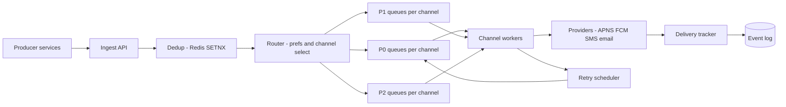

# Notification System

## Requirements

**Functional (v1)**

- One ingest API for every internal producer; channels: mobile push (APNS/FCM), SMS, email.
- Per-user preferences: channel opt-ins, quiet hours with timezone, unsubscribe (legally mandatory for marketing).
- Priorities: P0 transactional (OTP, security alerts, receipts), P1 product (mentions, reminders), P2 marketing (campaigns up to 50M recipients).
- Delivery tracking: per-notification, per-channel status (queued → sent → delivered → opened), queryable by producers and support.
- Idempotent ingest: producer retries must never double-send.

**Non-functional**

- ~500M notifications/day; campaign bursts enqueue 50M in minutes.
- P0 end-to-end p95 < 5 s — including during a P2 campaign blast; isolation between priorities is a hard requirement, not a nice-to-have.
- P2 may lag minutes to hours; throughput matters there, latency doesn't.
- No user-visible duplicates. Internally the pipeline is at-least-once everywhere; dedup at the edges makes it effectively-once to the user. True exactly-once delivery to a phone over a flaky network is impossible — effectively-once via dedup keys is the achievable contract, and this design says so explicitly.
- Provider quotas are external hard limits (contracts, not config): assume push 50K/s combined, email 10K/s, SMS 1K/s.

## Capacity estimation

- Volume: `500M/day ≈ 6K/s` average (500 × 12 RPS per 1M/day), peak ≈ 3× ≈ **18K/s**.
- Channel mix: push 70% ≈ 4.2K/s avg, email 25% ≈ 1.5K/s, SMS 5% ≈ 300/s — each compared against its quota (50K / 10K / 1K per second) to find headroom; SMS has the least (3.3×) and is the channel that backlogs first.
- Campaign drain math: 50M marketing pushes with P0/P1 consuming ~5K/s of the 50K/s push quota → P2 drains at ~45K/s → `50M / 45K/s ≈ 1,100 s ≈ 18 min`. Acceptable for marketing — and the queue, not the ingest API, absorbs the burst.
- Dedup state: 24 h of idempotency keys ≈ `500M × ~100 B ≈ 50 GB` in Redis — a small cluster.
- Status events: ~3 per notification × 500M/day × 200 B = **300 GB/day**; 90-day hot retention ≈ 27 TB in a wide-column store.
- Ingest is light (18K/s of ~1 KB requests ≈ 18 MB/s); every hard problem here is scheduling and provider quotas, not bytes.

## High-level architecture



- The **ingest API** validates, claims the idempotency key (SETNX), persists the request, and returns 202 — it never waits on a provider.
- The **router** resolves preferences, quiet hours, and channel choice, then enqueues onto per-channel, per-priority queues. Rendering happens later, at the worker.
- **Channel workers** pull by priority (strict P0 first, weighted below), reserve a token from the per-provider rate budget, render, and send. Transient failures go to the **retry scheduler**; receipts and provider webhooks flow into the **delivery tracker** and append-only **event log**.
- Queues are the heart of the design: priority isolation, burst absorption, and provider backpressure are all queue topology, which is why ingest stays fast no matter what providers are doing.

## API design

```
POST /v1/notifications
  Body: { "idempotency_key": "order-9912-shipped",
          "user_id": "u123", "template_id": "order_shipped",
          "data": {...}, "priority": "P0" | "P1" | "P2" }
  202:  { "notification_id": "n_8842" }      // same id returned on retried key

GET  /v1/notifications/{id}
  200:  { "per_channel": [ {"channel": "push", "status": "delivered", "ts": ...} ] }

POST /v1/campaigns                            // P2 bulk: audience ref, not 50M inline ids
  Body: { "template_id", "audience_id", "send_at_local": "2026-06-15T10:00" }

PUT  /v1/users/{id}/preferences               // opt-ins, quiet hours, timezone
POST /v1/receipts/{provider}                  // signed provider webhooks (delivery receipts)
```

- Always async, even for P0: a 202 plus a fast pipeline beats a synchronous provider call that welds producer latency to APNS's mood. The p95 < 5 s budget lives in the pipeline, not the HTTP response.
- Campaigns reference an audience snapshot; an expander materializes recipients into the P2 queue at a controlled rate — 50M ids never travel through one request.
- Webhook ingestion is itself idempotent (providers retry too — at-least-once arrives from both directions).

## Storage choices

- **Queues: Kafka**, topics per (channel × priority). Replayable (re-drive after a worker bug), high-throughput, ordered within partitions. Kafka has no native per-message delay, so retries use a **Redis sorted-set scheduler** (score = fire-at time; a sweeper moves due entries back into queues) — that build cost is steel-manned against SQS in tradeoffs.
- **Dedup: Redis** — `SETNX(idempotency_key → notification_id, TTL 24 h)`. 50 GB across a small cluster; details in the deep dive.
- **Event log: wide-column store**, row key `notification_id`, plus a `(user_id, day)` index for support lookups. Append-heavy (17K events/s avg), key-addressed reads, 27 TB hot — exactly the wide-column shape. Status writes are idempotent upserts keyed `(notification_id, channel)` with a monotonic status rank.
- **Preferences: SQL** primary + replicas (relational, transactional, modest size), cached in routers (cache-aside, versioned invalidation) — preference reads happen on every send and must not hit the primary 18K times a second.
- **Templates: SQL + immutable versioned blobs**; a send references `template_id@version`, so in-flight notifications are immune to template edits mid-campaign.

## Key components & deep dives

**Idempotency and dedup — SETNX at the front door, guards inside.**

- Ingest: `SETNX key → notification_id` (TTL 24 h). First call wins and creates; a retry loses the race, reads the existing value, and returns the same `notification_id` with 202 — producer retries are invisible downstream. The TTL is the honesty window: it must exceed the longest producer retry horizon, because a retry after expiry would double-send.
- Inside, every hop is at-least-once: Kafka redelivers, and a worker that crashes after the provider call but before committing its offset will cause a resend. So workers carry a second guard: `SETNX (notification_id, channel)` send-claim before calling the provider, and provider-side collapse keys (e.g., APNS `collapse-id`) where supported make residual duplicates replace rather than stack.
- Sum it honestly: at-least-once on every internal wire, effectively-once at the user's screen via layered dedup keys. Claiming more than that is the interview red flag this design avoids.

**Per-provider rate control and backpressure.**

- Each (provider, credential) gets a token bucket sized to contract — push 50K/s, email 10K/s, SMS 1K/s — shared by that channel's workers via atomic Redis ops. A worker reserves a token *before* rendering and sending; an empty bucket pauses consumption (workers sleep on the bucket, never spin, never drop).
- Backpressure is therefore structural: provider slowness → bucket drains → that channel's queue deepens → P2 lag grows. Nothing cascades to other channels or to ingest; lag depth per (channel, priority) is the operational gauge.
- Provider throttle signals (429s, APNS feedback) shrink the bucket multiplicatively and recover it slowly — adaptive politeness that avoids tripping provider-side penalties that cost more than the throughput gained.
- SMS arithmetic to volunteer: 1K/s contract means a 1M-recipient SMS campaign takes ~17 minutes *by contract*. Surface that in the campaign UI; don't let product discover it as a bug report.

**Priority scheduling — protecting P0.**

- Topology: per channel, three queues. Dispatch: strict priority for P0 — if the P0 queue is non-empty, workers take from it first, always; below that, weighted round-robin ~80/20 between P1 and P2 so marketing backlogs never starve product notifications entirely (and vice versa).
- Why P0 latency survives a 50M blast: P0 arrivals (~2K/s peak) are dequeued ahead of any P2 depth, and the push quota (50K/s) dwarfs P0's needs — so P0 queueing delay is governed by its own arrival rate, not by 50M queued P2 messages. Quantify the counterfactual: one shared FIFO queue puts the OTP behind 50M messages at 45K/s — an 18-minute OTP, i.e., product failure.
- Add a small reserved concurrency floor for P0 workers (immune to P1/P2 saturation), and per-user caps for non-P0 (e.g., 5/day) at the router — notification fatigue is a delivery-system failure mode too, just a slower one.

**Retries, backoff, and the dead-letter queue.**

- Classify before retrying. Permanent failures (invalid device token, hard email bounce, unsubscribed) never retry: mark failed, prune the token/address at the source. Transient failures (timeouts, 5xx, 429) retry with backoff.
- Standard schedule after the initial attempt: **1 m, 2 m, 4 m, 8 m, 15 m — five retries spanning a 30-minute backoff window (1 + 2 + 4 + 8 + 15 = 30)**. Jitter ±20% so a provider recovering from an outage isn't met by a synchronized retry wall.
- P0 OTPs can't wait 30 minutes — the code expires in ~5. Their schedule compresses (5 s, 15 s, 40 s), then **fails over to the next channel** (push → SMS) instead of exhausting retries on a dead channel.
- After the final retry: DLQ (a Kafka topic) with full context — original request, attempts, provider errors — for inspection and bulk re-drive. DLQ depth is paged; a growing DLQ is either a provider incident or a template bug, both urgent.

**Delivery tracking.**

- Per (notification, channel) state machine: `queued → sent` (provider accepted) `→ delivered` (provider receipt) `→ opened` (client beacon); failures branch to `failed(reason)`.
- Receipts arrive via webhooks: at-least-once, out of order, sometimes days late (email). The tracker upserts with a monotonic status rank — `delivered` can never be downgraded by a replayed `sent` — making webhook replays no-ops: effectively-once status from at-least-once receipts, same trick as the send path.
- The event log is append-only truth; the status API reads the rolled-up row. Campaign dashboards and provider-health metrics (delivery rate by provider/region) are downstream consumers of the same log — no second write path to drift.

## Common tradeoffs

**Kafka + homemade delay scheduler vs SQS-style broker.**

- SQS steel-manned: native per-message delay, native DLQs, per-message acks, zero scheduler code, effectively infinite elasticity — at 1/10 this scale it is flatly the better choice and pretending otherwise is resume-driven design.
- Kafka's case at this scale: replayability (re-drive a botched campaign from offsets), throughput per dollar at 18K/s sustained with 50M-burst absorption, strict per-partition ordering for per-user sequencing — paid for with the Redis delay scheduler you must build and operate.
- The honest pivot: choose by whether replay + ordered lanes + burst economics are worth owning a scheduler. Here they are; in a smaller shop they aren't.

**Render at ingest vs render at send.**

- Render-at-ingest: template bugs surface synchronously to the producer (nice), queue payloads are self-contained — but quiet-hours-delayed and retried sends go out with hours-stale content, locale/preference changes between enqueue and send are ignored, and 50M rendered emails bloat the queues ~10×.
- Render-at-send (chosen): correctness at the moment of truth — current prefs, locale, quiet hours — and lean queues (template_id + data); the costs are render compute scaling with sends and template failures surfacing late, mitigated by canarying template versions before full rollout.

**Strict priority everywhere vs weighted sharing.**

- Pure strict P0 > P1 > P2 is simple and makes P0's guarantee trivial to reason about — but a sustained P1 flood starves P2 indefinitely (campaigns never send during a busy product week, and "never" is a contract violation with marketing too).
- Pure WRR across all three protects everyone's progress but lets bulk traffic add jitter to P0 — unacceptable against a 5 s p95.
- The hybrid (strict for P0, WRR 80/20 below) gives the only tier with a latency SLO absolute precedence and everyone else guaranteed progress. Both pure forms fail a stated requirement; the hybrid fails none.

**One pipeline for all channels vs per-channel systems.**

- Per-channel systems steel-manned: email genuinely differs (multi-day receipt latency, suppression-list law, MIME rendering) and a bespoke email pipeline can honor that without contorting shared abstractions; teams scale and deploy independently.
- Unified pipeline (chosen): dedup, priorities, tracking, preferences, and the producer API are channel-agnostic — duplicating them three times triples the bug surface and guarantees drift (the OTP that dedups on push but not on SMS). Channel-specific behavior lives in workers (adapters), which is the layer where channels actually differ.

## Curveballs interviewers throw

1. **"APNS goes down for 30 minutes at peak."** Circuit breaker opens on error rate; push sends pause (tokens unreserved, queue absorbs). Backlog: `~12.6K/s push peak × 1,800 s ≈ 23M`. On recovery, drain at spare quota `50K − 12.6K ≈ 37K/s → ~10 min` to clear. Staleness handled by APNS collapse ids (old badge updates replaced, not stacked); P0s failed over to SMS during the window per the OTP policy. Nothing was lost, nothing duplicated, and the math was shown.
2. **"A provider webhook arrives twice, out of order — 'delivered' then 'sent'."** Monotonic-rank upsert: `delivered` (rank 3) is already stored; the late `sent` (rank 2) upsert is a no-op. Replays are no-ops by the same rule. This is the effectively-once pattern applied to inbound receipts — same principle as send-side dedup, pointed the other direction.
3. **"Why did this user get a marketing push at 3 a.m.?"** Quiet hours were evaluated at enqueue, then the campaign drained for hours and crossed midnight — the classic bug. Fix: evaluate quiet hours (and prefs, and unsubscribes) at *send* time in the user's stored timezone; quiet-hours-blocked sends park in the delay scheduler until the window opens. Scheduled "10 a.m. local" campaigns are per-timezone buckets, not one global enqueue.
4. **"Prove an OTP beats a 50M campaign in flight."** Chain the mechanisms: separate P0 queue (never behind P2 depth) → strict-priority dispatch (P0 head-of-line by construction) → reserved P0 worker floor (concurrency exists even at saturation) → quota headroom (P0's ~2K/s ≪ 50K/s). Each link removes one way bulk traffic could touch P0; the residual P0 latency is its own queueing only. Then show the shared-queue counterfactual: 18 minutes.
5. **"Black Friday: everything 10×."** Ingest, queues, workers scale horizontally — but provider quotas don't scale with your fleet: 50K/s push is 50K/s no matter how many workers wait on the bucket. So: pre-negotiate quota raises (lead time, not config), pre-stage campaign expansion to spread enqueue, tighten per-user caps, and let admission control push P2 lag to hours while P0/P1 ride reserved headroom. The bottleneck you don't own is the one to plan around — that's the sentence to leave the interviewer with.
