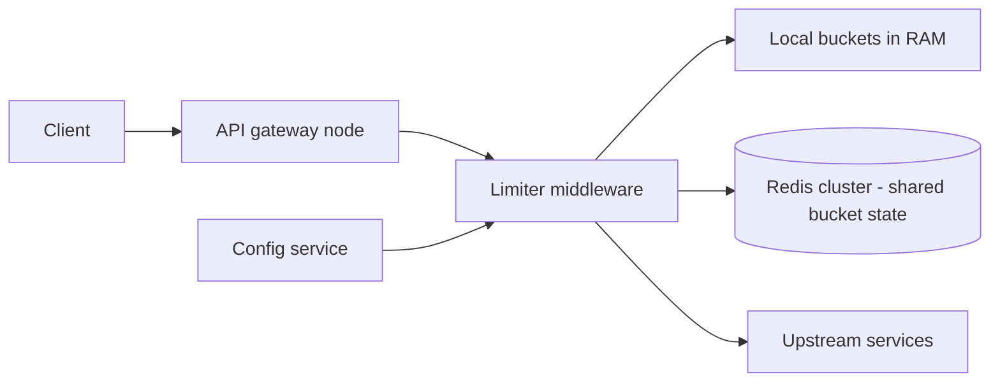

# Distributed Rate Limiter

## Requirements

**Functional (v1)**

- Limit requests per identity (API key, user id, or IP) against configurable rules, e.g. "100 req/s with burst 200" and "100K req/day" on the same key simultaneously.
- On rejection: HTTP 429 with `Retry-After`, plus `X-RateLimit-Limit / -Remaining / -Reset` headers on every response.
- Rules are hot-reloadable and support per-tenant overrides (paid tiers get bigger buckets).
- Out of scope v1: spend-based quotas (metered billing), CAPTCHA/challenge flows.

**Non-functional**

- The limiter sits on every request: its decision must add **< 1 ms p99** to a gateway fleet handling 1M RPS.
- Accuracy: ±1% over-admission is acceptable for product limits; auth-sensitive endpoints need strictness (different rule mode, not a different system).
- The limiter must never become the outage: if its state store is down, the API keeps serving (fail-open by default, per-rule override).
- Limits are enforced fleet-wide, not per-node — a client hammering one gateway and a client spraying all 50 must see the same limit.

Sign-off to state before estimating: contract limits enforced at the gateway, approximate by default with a per-rule strict mode, fail-open by default with per-rule override.

## Capacity estimation

- Fleet: `1M RPS across 50 gateway nodes = 20K RPS/node`.
- Counter state: token bucket = `{tokens, last_refill}` ≈ 100 B with key name → `10M active keys × 100 B ≈ 1 GB`. State is small; **operations per second are the constraint**.
- Naive central check: 1 Redis round trip per request = 1M Lua ops/s. At ~100K ops/s per Redis node that is a 10–12 shard cluster doing nothing but limiter math, plus 0.5 ms intra-DC RTT on every single request — the entire latency budget.
- Local-counter design (chosen): each node answers from RAM (~100 ns) and syncs per active key every 100 ms → Redis traffic ≈ `active (node, key) pairs × 10 syncs/s`, independent of request rate. A key doing 500K RPS costs the same ~500 sync ops/s as a key doing 50 RPS.
- The latency ratio that drives the whole design: local RAM check ~100 ns vs synchronous Redis check ~0.5 ms intra-DC RTT — three-plus orders of magnitude. The hybrid exists to spend the slow path only on rules that contractually need it.
- Sliding-window-log memory check, for contrast: a key at a 1,000-req/min limit holds `1,000 timestamps × 8 B = 8 KB` vs 100 B for a bucket — 80×; at 1M keys that is 8 GB vs 100 MB.

## High-level architecture



- The limiter is an in-process **middleware library** inside each gateway node, not a separate network service — the fastest RPC is no RPC.
- Decisions are made against **local token buckets in RAM**; an async loop reconciles each active key with the **shared Redis state** every ~100 ms, pulling the node's fair allowance and pushing its consumption.
- The **config service** stores rules; gateways watch and cache them in-process — zero per-request config reads.
- Redis is the coordination point, not a per-request dependency: when it is unreachable, nodes keep deciding from local state under conservative fallback rates.

## API design

The primary "API" is middleware behavior on every response:

```
200 OK
  X-RateLimit-Limit: 100
  X-RateLimit-Remaining: 37
  X-RateLimit-Reset: 1718210400

429 Too Many Requests
  Retry-After: 2
  Body: { "error": "rate_limited", "rule": "per_key_rps", "retry_after_ms": 1700 }
```

Control plane:

```
PUT  /v1/rules/{rule_id}
  Body: { "match": {"key_by": "api_key", "route": "/v1/*"},
          "limit": 100, "window_s": 1, "burst": 200,
          "mode": "approximate" | "strict", "on_error": "open" | "closed" }
GET  /v1/rules                       // list, with versions
GET  /v1/limits/{key}                // current usage, for support/debugging
```

- `mode: strict` forces a synchronous Redis check per request for that rule (auth endpoints, payment initiation); `approximate` uses the local-bucket fast path.
- `on_error` is per-rule fail-open/fail-closed — a policy decision the rule owner makes explicitly, not a global default buried in ops config.
- Always return `Retry-After`: well-behaved clients back off exactly as long as needed, which itself reduces load.

## Storage choices

- **Redis (cluster)** for shared bucket state: atomic Lua read-modify-write per check or sync, in-memory speed, per-key TTL (~2× window) so idle keys expire and memory self-cleans. Bucket state is *reconstructible* — losing it means brief over-admission, not data loss — so no persistence, no replicas beyond what failover convenience justifies.
- **Config store** (small SQL or etcd): rules are tiny, relational (tenant → overrides), and need watch/notify. Pushed to nodes, cached in-process, versioned for instant rollback.
- **No durable request log** in the enforcement path. If billing-grade metering is ever needed, that is an offline pipeline over access logs — enforcement and accounting have different accuracy/latency contracts; don't weld them together.
- Clock discipline: refill arithmetic uses Redis server time (`TIME` inside the Lua script) for shared state and a monotonic clock for local buckets — never compare wall clocks across machines.

## Key components & deep dives

**Algorithm choice — token bucket, and why not the other three.**

- *Fixed window:* one counter per window; two ops; the boundary bug is disqualifying — a 100/min limit admits 100 requests at 0:59 and 100 more at 1:01: 200 in two seconds, a 2× burst by construction.
- *Sliding-window log:* store every request timestamp; exact by definition. Per check it pays an insert **plus** cleanup of expired entries (e.g., ZADD + ZREMRANGEBYSCORE), and memory grows with `rate × window` — the 8 KB/key and 8 GB/fleet numbers above. Exactness priced per request.
- *Sliding-window counter:* `current + previous × overlap` with two counters (16 B); assumes uniform arrivals in the previous window, so error concentrates when traffic bursts at window edges — bounded and small in practice, but it has no burst concept at all.
- *Token bucket (chosen):* two fields; refill computed lazily from `last_refill` (no background job); and it models the product truth directly — a sustained `rate` plus a `burst` allowance are two different promises, and the bucket makes both explicit. Worked example: rate 100/s, burst 200; idle 2 s → bucket full at 200; client fires 200 instantly (allowed — that's the burst contract), then sustains 100/s.

**Distributed counters — local buckets + periodic sync.**

- Every node holds a local bucket per active key. Every 100 ms per key, a pipelined Lua sync pushes the node's consumption delta and pulls a refreshed allowance: `remaining ÷ nodes_actively_serving_this_key` (Redis tracks reporters per key with a short TTL, so allowance concentrates on the nodes actually seeing the traffic — a single-node client gets ~the full rate, a spraying client gets it split).
- Worst-case over-admission is bounded by one sync interval of skew: traffic that shifts abruptly between nodes can over-admit roughly `rate × 0.1 s` per shifted node before the next sync corrects allowances — for a 1,000/s key, ~100 extra requests in that 100 ms, transient and self-correcting.
- State the contract plainly: the fast path is approximate by design, accurate to within a sync interval. Rules with `mode: strict` skip local buckets and pay the 0.5 ms synchronous Lua check — correctness where it matters, speed everywhere else.

**Hot keys and fairness.**

- A tenant at 500K RPS concentrates on one bucket key → one Redis shard. The local-bucket design already defused this: per-key Redis load is sync-cadence-bound (~10 ops/s per node per key, ~500/s fleet-wide), not request-bound. The hot key costs the same as a warm one — this is the central payoff to present.
- Local bucket lookups are a RAM read (~100 ns) in a per-node hash map — 20K RPS/node of limiter checks is negligible CPU.
- Fairness is a separate problem from limiting: a tenant *under* its limit can still saturate shared upstream capacity. Complement rate caps with per-tenant concurrency caps and weighted fair queuing at the gateway when upstreams are saturated — the limiter answers "is this client within contract?", fairness machinery answers "who gets capacity under contention?".

**Fail-open vs fail-closed.**

- Redis unreachable: a circuit breaker trips after N consecutive timeouts; nodes continue on local buckets with a conservative fallback allowance (`limit ÷ node_count`), then probe half-open.
- Default fail-open (with the local fallback, "open" still enforces approximately): for product endpoints, over-admitting for 30 s is a non-event; serving 5xx because a *limiter dependency* died is an outage you caused.
- Fail-closed for the short list where over-admission is the incident: login, OTP verification, password reset — endpoints where the limiter is a security control, not a courtesy. Per-rule `on_error` makes the owner choose.
- Either way, emit a metric the moment fallback engages: silent degraded enforcement is how you discover a credential-stuffing run a week late.

## Common tradeoffs

**Token bucket vs sliding-window counter.**

- Both are O(1) time and state, both are fleet-syncable. Sliding-window counter enforces a smoother ceiling (no sanctioned burst), which suits "protect the database" limits where a 2× spike is exactly what you're preventing.
- Token bucket exposes burst as a first-class, documentable knob, which suits public API contracts ("100 rps sustained, bursts to 200") and absorbs legitimate bursty clients (page loads, batch flushes) without 429ing them.
- Pick by whether bursts are a feature (bucket) or the threat (sliding counter). We default to the bucket because customer-facing limits are contracts, and contracts need the burst clause written down.

**In-process library vs dedicated limiter service.**

- Dedicated service (Envoy-style global RLS): one implementation for a polyglot fleet, central operations, limits evolve without redeploying gateways. Cost: +1 network hop (~0.5–1 ms) on every request — the entire stated budget — plus a new tier to capacity-plan whose failure mode is in the request path.
- In-process library (chosen): zero added hops, scales automatically with the gateway fleet; cost: per-language implementations and config-distribution discipline.
- The decision pivots on fleet homogeneity: one or two gateway languages → library; truly polyglot enforcement points → the service hop is the price of consistency.

**Central-exact vs local-approximate counting.**

- Central: every decision sees the global truth; ±0 error; pays RTT and a Redis fleet sized to request volume, and inherits Redis tail latency into API tail latency.
- Local + sync (chosen): RAM-speed decisions, Redis sized to key count not request count; pays bounded transient over-admission (one sync interval) and reconciliation code that must be right.
- The honest rule: enforcement protecting *capacity* tolerates 1% slack; enforcement protecting *security or money* does not. Run both modes, route rules accordingly.

**Where the limiter lives: edge vs service-local.**

- Edge/gateway (chosen): rejects cost ~zero upstream work; one enforcement point; per-client context (API key) is naturally present.
- Service-local limiters: protect each service's actual bottleneck (DB connections, worker pools) with limits in the service's own units; but a request rejected deep in the stack already spent gateway, auth, and routing work.
- Production systems want both layers: contract limits at the edge, self-protection (load shedding, concurrency caps) at each service. Present them as complementary, not competing.

## Curveballs interviewers throw

1. **"Redis dies entirely. What exactly happens at t+1s, t+30s?"** t+1s: in-flight syncs time out, circuit breaker trips, nodes switch to local fallback allowances (`limit ÷ 50` per node) — enforcement continues, conservatively for spread traffic, leniently for single-node traffic; fail-closed rules start rejecting. t+30s: breaker half-open probes; meanwhile alerting fired on the fallback metric. Key talking point: the API never stopped serving, and enforcement degraded predictably rather than vanishing.
2. **"Two gateways disagree because their clocks drift 2 s apart."** They never compare wall clocks: shared-state refill math runs on Redis `TIME` inside the Lua script (one authoritative clock), local buckets run on each node's monotonic clock (immune to NTP steps). Cross-node skew therefore cannot corrupt counts; the only clock that orders anything is Redis's.
3. **"A customer demands exact limits for billing."** Don't bend the fast path — split the contract. Enforcement stays approximate (it protects capacity); metering becomes an offline aggregation over access logs feeding invoices, with reconciliation tolerances in the contract. If they truly need exact *enforcement* (hard spend caps), that rule runs `mode: strict` on a dedicated Redis shard and eats the 0.5 ms — priced as the premium feature it is.
4. **"Make a 1,000/s limit global across 3 regions."** Synchronous global checks are physics-bound: 60–150 ms cross-region RTT vs a 1 ms budget. Partition the quota by observed traffic share (e.g., 600/300/100), rebalance asynchronously every few seconds, and accept transient over-admission ≈ one rebalance interval during regional shifts. A regional partition leaves each region enforcing its slice — degraded accuracy, never unavailability.
5. **"Why is your fixed-window competitor wrong, exactly?"** Walk the boundary proof: limit 100/min; client sends 100 at 0:59.5 and 100 at 1:00.5 — both windows individually legal, 200 requests in one second, sustained 2× the contract every minute boundary if scripted. Then the kicker: sliding-window counter fixes it with 16 B of state, so the defense "fixed window is simpler" buys almost nothing. This is the question that checks whether you can argue with arithmetic instead of vocabulary.
