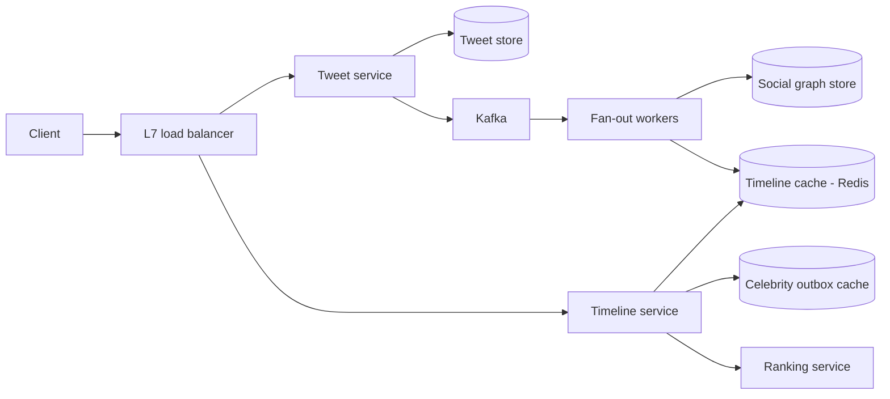

# Twitter Home Feed

## Requirements

**Functional (v1)**

- Post a tweet (≤ 280 chars, media by reference to a blob store).
- Follow / unfollow users.
- Home timeline: a ranked feed of recent posts from accounts the user follows, paginated.
- Out of scope for v1: search, DMs, notifications, ads, trends.

**Non-functional**

- 100M DAU; ~1 tweet/DAU/day posted; ~20 timeline fetches/DAU/day; average 200 followers; a small set of accounts have millions.
- Timeline read p99 < 200 ms.
- A new tweet should appear in followers' feeds within ~5 s — eventual consistency on timelines is acceptable and should be said out loud.
- A published tweet is never lost (durable on ack); timelines, by contrast, are rebuildable views.
- 99.95% availability on the read path — the feed is the front door of the product.

Key asymmetry to name early: tweets are written once and read by hundreds of people. Denormalization (copying tweet ids into follower timelines) is buying read latency with write amplification.

## Capacity estimation

- Tweet writes: `100M / day ≈ 1,200 WPS` average (1M/day ≈ 12 RPS), peak 3× ≈ **3,600 WPS**.
- Timeline reads: `100M × 20 = 2B/day ≈ 24K RPS` average, peak ≈ **72K RPS**.
- Fan-out write amplification — the number that drives the whole design: `100M tweets/day × 200 followers = 20B timeline inserts/day ≈ 240K inserts/s` average, ~720K/s peak. 200× the tweet write rate.
- Tweet storage: ~1 KB/tweet × 100M/day = 100 GB/day ≈ **36 TB/year**, ~110 TB/year with 3× replication.
- Timeline cache: 800 tweet ids × 8 B = 6.4 KB/user; × 100M active users ≈ **640 GB** (~800 GB with overhead) — a ~30-node Redis cluster.
- Hydration reads: 24K timeline RPS × ~50 tweets rendered ≈ `1.2M tweet lookups/s` — served from the tweet store's row cache and the hot-tweet local cache replicas; state this number or the tweet store sizing looks like magic.
- Celebrity math that justifies the hybrid: one tweet by a 10M-follower account = 10M inserts ≈ `10M / 240K/s ≈ 42 s` of the entire fan-out fleet's average throughput, for one tweet.

## High-level architecture



- **Write path:** tweet service persists the tweet (durability point), appends it to the author's outbox, and emits an event to Kafka. Fan-out workers read the author's follower list from the social graph store and push the tweet id into each follower's cached timeline — unless the author is over the celebrity threshold, in which case fan-out is skipped.
- **Read path:** timeline service reads the user's precomputed id list from the timeline cache, merges in fresh tweets from any celebrity accounts the user follows (their outboxes), hydrates the top candidates from the tweet store, and hands them to the ranking service for scoring.
- Tweets are the source of truth; timelines are disposable, rebuildable projections. That asymmetry is what makes aggressive caching safe.

## API design

```
POST /v1/tweets
  Headers: Authorization, Idempotency-Key
  Body:    { "text": "...", "media_ids": [] }
  201:     { "tweet_id": "1794620371482" }   // snowflake id: time-ordered, no coordination
```

```
GET /v1/timeline?cursor=<opaque>&limit=50
  200:     { "tweets": [...], "next_cursor": "..." }
```

```
POST /v1/users/{id}/follow      DELETE /v1/users/{id}/follow
```

- Idempotency key on post: a client retry after timeout must not double-post.
- Cursor pagination, never offset: the feed shifts under concurrent inserts, and deep offsets degrade. The cursor encodes (position, snapshot hint) so page 2 doesn't repeat page 1 after new tweets arrive.
- Snowflake-style ids (timestamp | worker | sequence) give time-sortable ids without a central sequencer — timelines can be merged by id alone.

## Storage choices

- **Tweet store:** wide-column (Cassandra-class), keyed by tweet_id, plus a per-author outbox table `(author_id, tweet_id desc)` time-bucketed so no partition grows unbounded. Append-heavy at 3,600 peak WPS with key-based reads — exactly the wide-column sweet spot. AP-leaning: a feed read tolerates possibly stale data; it must not error out during a partition.
- **Social graph:** two adjacency tables, `followers(user_id) → [follower_ids]` and `followees(user_id) → [followee_ids]`, sharded by user_id. Both directions are stored because both are read on hot paths (fan-out reads followers; timeline rebuild reads followees) — a deliberate denormalization. No graph database: every query is 1-hop adjacency, never traversal.
- Graph sizing while you're there: `100M users × 200 edges × 8 B ≈ 160 GB` per direction, ~320 GB for both tables — small enough to cache hot adjacency lists in RAM, which is what keeps fan-out's follower-list reads off disk.
- **Timeline cache:** Redis — 800 packed tweet ids per active user, no durability. Loss of a node = rebuild on next read (deep dive below). Caching a *view* rather than data is why eviction is harmless.
- **Counters (likes/retweets):** sharded eventually-consistent counters, read with the tweet hydration batch. Exact-at-read is not a requirement; say so instead of paying for it.

## Key components & deep dives

**Fan-out pipeline.**

- Tweet event → Kafka, partitioned by author_id (preserves per-author order). Workers chunk the follower list (1,000 per batch) and pipeline LPUSH+LTRIM(800) into follower timelines.
- Sized against the estimate: 240K inserts/s average, 720K/s peak — pipelined Redis ops at ~100K ops/s/node mean the ~30-node cluster handles it with headroom; the same cluster serves the 72K RPS read peak comfortably.
- Inserts are idempotent in effect: re-delivered events re-push the same tweet id, and hydration dedups by id — so Kafka's at-least-once delivery needs no exactly-once machinery on top.
- Consumer lag is the health metric. Lag means new tweets silently missing from feeds (the failure is invisible — no errors, just staleness), so alert on lag seconds, not worker CPU.
- LTRIM to 800 caps every timeline's memory; beyond 800 entries users hit the rebuild path anyway.

**The celebrity problem — hybrid fan-out.**

- Pure push breaks on big accounts: a 10M-follower tweet costs 42 s of total fleet throughput; a Cristiano-scale account (500M) costs ~35 minutes. Pure pull breaks the read path instead: every timeline load k-way merges ~200 outboxes.
- Hybrid: authors under a follower threshold are pushed; authors over it write only to their own outbox. At read time the timeline service merges the precomputed list with fresh tweets from the user's over-threshold followees.
- Pick the threshold by arithmetic, not folklore: at 100K followers, the worst single-tweet fan-out is 100K inserts ≈ `100K / 240K/s < 0.5 s` of fleet throughput. On the read side, a typical user follows a handful of over-threshold accounts, so the merge adds ≤ ~10 outbox reads — single-digit ms in parallel.
- The hybrid wins because it caps worst-case cost on both paths: no tweet fans out to more than 100K timelines, and no read merges more than ~10 outboxes. Either pure strategy has an unbounded worst case; the hybrid's are both bounded by the threshold knob.

**Timeline cache and rebuild-on-miss.**

- Hit path: one MGET-style fetch of 800 ids, hydrate the top ~200 from the tweet store's row cache, rank, return 50. Cache hit dominates p99 — RAM reads (~100 ns) plus one intra-DC round trip.
- Miss path (returning user, eviction, lost Redis node): fall back to pull — fetch the followee list, read each followee's recent outbox (latest ~100 ids), k-way merge by snowflake id, cache the result. ~200 parallel outbox reads ≈ tens of ms — slow-but-correct, and it doubles as the recovery story: losing a whole cache node degrades latency for affected users, never correctness.
- Evict timelines for users inactive > 7 days; rebuild costs are paid by exactly the users who weren't reading anyway.

**Ranked timeline at read time.**

- Store and merge candidates chronologically; apply ranking when the user asks, scoring ~200 hydrated candidates with a lightweight model (recency decay, precomputed author-affinity score, engagement priors) under a ~30 ms budget.
- Ranking at read time keeps the cached data model-agnostic: shipping a new model changes scoring code, not 100M cached lists. Rank-at-write would bake yesterday's model into every timeline and make A/B tests a data migration.
- Degradation lever: if the ranking service is slow or down, serve chronological — the feed gets worse, not broken. Cheap insurance, explicitly designed in.

## Common tradeoffs

**Fan-out-on-write vs fan-out-on-read.**

- Fan-out-on-write: O(1) cache-hit reads — the product feels instant; write amplification of 200× (20B inserts/day), wasted work for inactive followers, and an unbounded worst case on mega-accounts.
- Fan-out-on-read: writes stay O(1) — no amplification, no celebrity cliff, no fan-out fleet to operate; every read does a k-way merge over ~200 outboxes, so read latency scales with followee count and the 72K RPS peak multiplies into ~14M outbox reads/s. Strong choice when reads are rare relative to writes or the graph is extremely skewed.
- The hybrid is not a compromise but a cap on both worst cases (see deep dive). Defend the threshold with the 0.5 s / 10-outbox arithmetic, not with appeals to what big companies do.

**Ranked vs chronological.**

- Chronological: trivially correct pagination, transparent to users, cacheable as a pure list, zero scoring compute. Its real product cost: heavy posters dominate, and infrequent visitors miss the posts they'd care about most.
- Ranked: surfaces high-affinity content (measurably higher engagement and session length), tolerates following thousands of accounts; costs scoring compute on every read, harder-to-reason-about pagination, and erosion of user trust if unexplained.
- Choose ranked-by-default with a chronological toggle: the toggle is nearly free given rank-at-read (skip the scoring step), and it doubles as the degradation path.

**Redis timelines vs persistent timeline store.**

- Redis: cheapest possible reads; loss = rebuild (acceptable because the pull path exists); ~800 GB RAM bill.
- Persistent (wide-column) materialized timelines: survive restarts — no rebuild storms after an AZ event, capacity is disk-priced not RAM-priced; every fan-out insert becomes a durable write (20B/day of LSM traffic) and reads lose the in-memory speed that justified push in the first place.
- Decide by rebuild-storm tolerance: with the pull fallback and 7-day eviction, the rebuild surface is small, so RAM-only is the better bill. If product required 3,000-entry timelines for all 500M registered users, disk-backed wins.

**Snowflake ids vs central sequence.**

- Central sequence: globally dense, strictly ordered ids — and a write-path dependency with failover risk at 3,600 WPS.
- Snowflake: coordination-free, time-sortable (enables merge-by-id everywhere), at the cost of ~ms-granularity ordering and clock-skew care (NTP discipline, sequence bits per worker). Feeds need merge-sortable, not transactionally dense — snowflake.

## Curveballs interviewers throw

1. **"A 100M-follower account tweets during the World Cup final."** Fan-out is skipped (over threshold) — the write path doesn't care. The read path does: that tweet's row becomes a hot key read by every timeline hydration. Mitigate with a local cache replica of hot tweets in each timeline-service process (promoted by a request-rate sketch, ~1 s TTL), so the tweet store sees hundreds of reads/s instead of hundreds of thousands. The like-counter write storm goes to sharded counters, not a single row.
2. **"A user follows 20,000 accounts."** The pull/merge path explodes for them (20K outbox reads). Cap the merge set: rank followees by affinity and merge only the top ~800; beyond that, accept sampled completeness. These accounts are rare — handle them with a per-user policy, not a redesign.
3. **"A tweet is deleted after fanning out to 1M timelines."** Don't chase the copies. Timelines hold ids, not content; hydration consults the tweet store, which now returns a tombstone, and the id is dropped from the response (and lazily from the cache). Deletion is consistent at hydration time even though 1M cached lists still contain the id.
4. **"Your fan-out backlog hits 30 minutes. What do users see, and what do you do?"** Users see stale feeds — new tweets missing, no errors (author profiles, which read outboxes directly, stay fresh). Triage: scale consumers (Kafka partitions permitting), prioritize fan-out for recently-active followers and defer dormant ones, and temporarily lower the celebrity threshold (e.g., 100K → 20K) so the heaviest fan-outs shift to the read path. Prevention: lag-based autoscaling and per-author fan-out budgets.
5. **"10× to 1B DAU."** Recompute: 12K WPS tweets, 720K RPS reads, 2.4M timeline inserts/s, ~8 TB of timeline cache. Fan-out fleet and Redis shard out linearly; the social graph store becomes the watch item (follower lists of 100M+ need chunked, streamed reads); and the celebrity threshold drops further because amplification grew while the insert budget per tweet didn't. The architecture holds; the knobs move.
