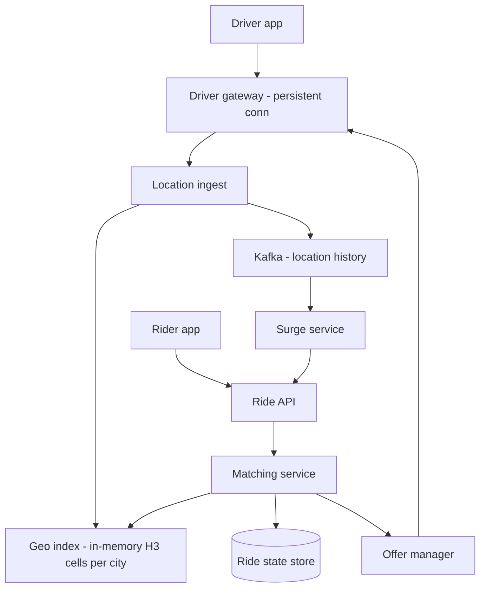

# Uber Dispatch (Ride Matching)

## Requirements

**Functional (v1)**

- Drivers stream location continuously while online; riders request a ride and get matched to a nearby driver.
- Sequential offer flow: driver sees an offer, accepts or declines within a timeout; declines cascade to the next candidate.
- Surge pricing per area, shown to the rider before requesting and locked at request time.
- Out of scope v1: payments, the routing/ETA engine internals (treated as a callable service), pooled rides.

**Non-functional**

- 1M peak concurrent online drivers; 20M rides/day.
- Driver location freshness ≤ 5 s; an offer reaches a driver's phone < 2 s after request; accepted match p90 < 30 s end-to-end.
- Location data is best-effort — dropping a fix is fine, the next one supersedes it. Ride state is the opposite: transitions (offer, accept, cancel) are never lost or doubled. Two drivers must never be dispatched to one rider, and one driver must never hold two rides.
- Dispatch availability 99.95%, sharded by city so one city's failure never strands another.

The two data planes have opposite contracts — cheap-and-lossy locations vs transactional ride state — and the architecture should visibly separate them.

## Capacity estimation

- Location ingest: GPS sampled ~1/s; clients buffer fixes in ~1 s windows and ship a batch every ~4 s → `1M drivers / 4 s = 250K batches/s`, carrying `1M fixes/s`.
- Ingest bandwidth: batch ≈ 4 fixes × 30 B + ~80 B envelope ≈ 200 B → `250K × 200 B ≈ 50 MB/s` fleet-wide. Trivial — the work is index updates, not bytes.
- Live driver state: `1M × ~100 B (id, cell, lat/lng, ts, status) = 100 MB`. The entire live world fits in one process's RAM; shard by city anyway for isolation and locality.
- Index update cost: coalesce to latest-fix-wins → ≤ 1M cell updates/s, each two hash-set operations on RAM (~100 ns each) → a few CPU cores fleet-wide. Geo-indexing is cheap when the index is in memory; say this to kill the "we need a geo-database" reflex.
- Ride requests: `20M/day ≈ 240 RPS` average (20 × 12), peak ~700 RPS globally — but concentrated: size matching per city shard, where a big city's Friday peak might be 50 req/s.
- Location history (off hot path): 1M fixes/s × 30 B ≈ 30 MB/s → Kafka → object store ≈ **2.6 TB/day** for ETA models and analytics.

## High-level architecture



- Drivers hold one long-lived TCP/TLS connection to a **gateway**; location batches flow up it, offers flow down it.
- **Location ingest** updates the in-memory **geo index** (H3 cells → driver sets, sharded by city) and tees every fix to Kafka for offline use. Nothing on the hot path persists locations.
- The **matching service** answers a ride request by querying the geo index for nearby candidates, ranking them by ETA, and driving the **offer manager**'s one-driver-at-a-time state machine. Ride and driver state transitions commit to the **ride state store** on the same city shard.
- The **surge service** consumes demand/supply signals from the stream and publishes per-area multipliers to the ride API.

## API design

```
POST /v1/rides
  Headers: Idempotency-Key
  Body: { "pickup": {lat,lng}, "dropoff": {lat,lng}, "product": "x" }
  201:  { "ride_id", "state": "matching", "surge_multiplier": 1.5, "quoted_eta_s": 240 }

GET  /v1/rides/{id}            // state machine snapshot; riders also get push events
POST /v1/rides/{id}/cancel
```

Driver connection frames:

```
loc_batch: { fixes: [{lat,lng,ts,heading}, ...] }            // up, every ~4 s
offer:     { ride_id, pickup, payout, expires_at }           // down
respond:   { ride_id, action: accept | decline }             // up; accept is a CAS
```

- Idempotency key on ride creation: a rider's retry after timeout must not summon two cars.
- `accept` returns 409 if the offer expired or the ride was taken — the client renders "no longer available" instead of a ghost assignment.
- The surge multiplier shown at request time is locked into the quote; repricing mid-match is a trust killer.

## Storage choices

- **Geo index: in-memory, deliberately non-durable.** `cell → set(driver_id)` plus `driver → {cell, fix, status}`, sharded by city. A crashed shard rebuilds from the live stream in seconds — every online driver re-reports within ~4 s — so durability would buy a benefit measured in seconds and cost a write-amplified database on the hottest path. State that rebuild argument explicitly; it justifies the whole tier.
- **Ride state store: transactional SQL, partitioned by city.** The ride and driver state machines need atomic compare-and-set transitions and are CP by requirement: during a partition, dispatch in the affected slice errors/times out rather than risk double-assignment. Keeping a ride and its candidate drivers on the same city shard makes offer/accept a single-shard transaction — no distributed commit on the hot path.
- **Location history: Kafka → object store.** Consumers: surge, ETA model training, support/forensics. Nothing user-facing reads it synchronously.
- **Surge state:** per-cell counters and EMAs in Redis, multipliers published to a small replicated config store read by the ride API.

## Key components & deep dives

**Geo index — H3 cells over a quadtree.**

- Hex cells at H3 resolution 8 (~0.74 km², edge ~460 m) are the index unit. A driver update is a pure-function `latlng → cell_id` plus moving the driver id between two hash sets — O(1), no tree to rebalance under 1M moving points.
- Nearby search = k-ring expansion: ring 1 = 7 cells, ring 2 = 19; expand until ≥ N candidates (say 10), then rank. Hexes have near-uniform center-to-neighbor distance, so "ring k" is a clean distance proxy; square grids distort along diagonals.
- Sharding is trivial because cell ids are stable: assign cell ranges (effectively cities) to shards. A tree structure would force rebalancing decisions; a fixed grid never moves.
- Density skew (Manhattan cell: 500 drivers; rural cell: 0) is handled at query time by k-ring expansion, and in dense cores by indexing one resolution finer (res 9) under the same scheme.

**Location ingestion — best-effort by design.**

- Clients buffer GPS fixes in ~1 s windows and send small batches every ~4 s over their existing long-lived TCP/TLS connection — the same one that delivers offers; carrier NATs and cellular middleboxes are kindest to a single persistent stream, and offers need it anyway.
- Best-effort delivery: a lost batch is not retried as-is — retransmitting a stale position is worse than waiting 4 s for a fresher one. The client folds unsent fixes into the next batch; the server applies last-write-wins per driver keyed by fix timestamp and discards out-of-order stale fixes.
- Freshness budget: 4 s send cadence + ~1 s pipeline < the 5 s requirement, with headroom for one dropped batch (worst case ~9 s, visible as a slightly stale pin — acceptable and stated).
- Under ingest overload, shed oldest fixes first; never queue stale locations. A location pipeline that buffers is lying to the matcher.

**Matching — sequential offers, no ghost matching.**

- Ghost matching is the failure class: a driver shown as available who already accepted elsewhere, or two rides racing to the same driver. Prevention is a per-driver state machine — `idle → offered(ride_id, ttl) → on_trip` — with atomic CAS transitions in the city shard's ride state store. One outstanding offer per driver, ever.
- Flow: matcher pulls candidates from the geo index (the index is a hint, not truth), filters through driver state (CAS `idle → offered`), and the offer manager sends the offer with a 12 s TTL. Accept = CAS `offered → on_trip` + `ride: matching → accepted` in one local transaction. Decline/expiry = CAS back to `idle`, next candidate.
- Sequential-by-default bounds worst-case match time: 3 candidates × 12 s = 36 s worst case before radius widening; p90 stays < 30 s because ETA-ranked first offers usually accept.
- Escalation: after 2 rounds, widen the k-ring and offer to 2 drivers in parallel; the first accept's CAS wins, the loser's accept returns 409 → client shows "no longer available". Bounded parallelism recovers latency without reintroducing unbounded races.

**Surge pricing with EMA smoothing.**

- Raw signal per cell cluster: `demand (requests, last 5 min) / supply (open drivers)`. Small denominators make it spiky — 3 requests over 1 driver must not instantly print 3×.
- Smooth with an EMA every 30 s tick: `s_t = 0.2 × x_t + 0.8 × s_{t−1}` → half-life ≈ 3.1 ticks ≈ **~90 s** (0.8^3.1 ≈ 0.5). Surge responds in minutes, not seconds — deliberate, because price flapping burns trust on both sides of the market.
- Map the smoothed ratio to stepped multipliers (1.0 / 1.2 / 1.5 / 2.0) with hysteresis — enter 2.0 above ratio 1.8, exit below 1.4 — so boundary noise can't oscillate the price.
- Compute per cell cluster (groups of res-8 cells), not per cell: fine-grained surge creates gameable price cliffs a block apart and reads as arbitrary; cluster-level pricing is smoother and defensible.

## Common tradeoffs

**H3/geohash grid vs quadtree.**

- Quadtree, steel-manned: adapts depth to density, so one structure serves Manhattan and rural Kansas with bounded points per leaf; range/radius queries are natural; no resolution to choose up front.
- Its bill under this workload: 1M moving points = constant insert/delete churn with rebalancing and concurrency control on a mutable tree, and sharding a tree across machines means partitioning a structure whose shape changes under write load.
- Fixed grid (chosen): O(1) pure-function updates, stable shard boundaries, precomputable neighbor sets; costs a resolution choice and query-time k-ring logic for sparse areas.
- Decision rule worth saying: high-churn moving points + simple proximity queries → fixed cells; static or slowly-changing points + rich spatial queries → tree structures earn their complexity.

**Sequential offers vs broadcast.**

- Broadcast to ~5 drivers, steel-manned: lowest time-to-accept (the fastest finger wins), resilient to one distracted driver, and ideal in supply-rich dense cores; eats CAS races as routine — 4 of 5 acceptors are told "too late".
- That rejection experience is corrosive: drivers learn accepts are lotteries and start ignoring offers, degrading the very acceptance rate broadcast was buying. Plus duplicated wake-ups and payout-screen renders per ride.
- Sequential (chosen): exclusive, clean offers; slower worst case, bounded by TTL math and recovered via the parallel-escalation tier. Hybrid-by-escalation captures most of broadcast's upside in exactly the supply-starved cases that need it.

**In-memory geo index vs durable geo store.**

- Durable store, steel-manned: restart without a warm-up window, historical queries in one place, no rebuild logic to test. Cost: every one of ~1M fixes/s becomes a database write on the latency-critical path — write amplification purchased to protect data with a 4-second half-life.
- In-memory (chosen): the data outlives its usefulness faster than any disk failure window; rebuild-from-stream covers crashes in seconds; history lives separately in Kafka/object store where it belongs.

**Surge granularity — fine cells vs clusters.**

- Per-cell: maximally responsive incentives, positions drivers precisely; but noisy (tiny denominators), gameable (drive 400 m, earn 0.5× more), and riders perceive block-level price differences as arbitrary.
- Per-cluster/zone (chosen): statistically stable ratios, smoother rider experience, harder to game; slower to react to hyper-local spikes — partially recovered by the EMA's modest lag and event-calendar priors.

## Curveballs interviewers throw

1. **"A stadium lets out: 10K requests in 10 minutes in three cells."** Matching: per-cell candidate exhaustion → k-ring widens, request queue forms with honest rider ETAs rather than silent spinners. Surge: ratio spikes, EMA carries it up over ~2 minutes, multiplier steps to max — by design, since price is the only real-time supply lever. Proactive: event-calendar priors pre-position supply via driver heatmap nudges before the final whistle. The system bends (longer waits, higher prices) — it must not break (ghost matches, dropped state).
2. **"GPS is garbage downtown — drivers teleport across the river."** Server-side plausibility filter: reject fixes implying > 50 m/s travel, snap-to-road against the map graph, and use heading/speed continuity for tunnels. Matching reads filtered positions; raw fixes still land in Kafka for forensics. Never dispatch or pay on raw client coordinates — location is client-asserted data and some clients lie.
3. **"Driver's phone dies mid-offer."** The offer TTL is the safety net: 12 s pass, CAS back to `idle` (driver) and on to the next candidate (ride). If the driver reconnects and accepts late, the CAS fails → 409 → "no longer available". If the phone dies *after* accept, no-movement-toward-pickup timeout triggers rider-side rematch and flags the driver. Every limbo state has exactly one timeout-driven exit — walk them.
4. **"Rider requests at a city/shard boundary."** The k-ring spans two shards → scatter-gather candidate queries to both (bounded: a ring touches ≤ 2–3 shards), merge by ETA; the ride transaction homes on the pickup cell's owner shard. Drawing shard borders through low-density corridors (rivers, highways) keeps boundary queries < 1% of traffic. The wrong answer is one global index — you'd trade a rare 2-shard query for a permanent global hot spot.
5. **"One city grows 10×."** The geo index laughs (100 MB → still RAM; hash ops scale), but the city shard's *matcher and offer manager* serialize per-driver state transitions — that's the real bottleneck. Split the city into sub-shards by cell prefix with the same boundary-drawing care, partition the offer manager by driver_id, and keep ride transactions single-sub-shard by homing them where the pickup is. The architecture's unit of scale was always "a city slice", so 10× one city = more slices, not a redesign.
