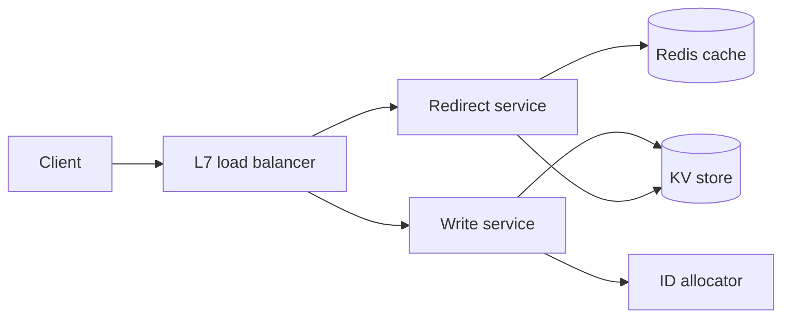

# URL Shortener

## Requirements

**Functional (v1)**

- Shorten: given a long URL, return a short link whose slug is at most 8 characters.
- Redirect: `GET` on the short link sends the browser to the original URL.
- Optional custom alias: caller may request a specific slug; reject if taken.
- Out of scope for v1: click analytics, user dashboards, link editing after creation.

**Non-functional**

- 100M new URLs per month; read:write ratio ~100:1 — read-heavy, and the redirect path is the product.
- Redirect p99 < 100 ms.
- 99.9% availability (~43 minutes of downtime budget per month).
- A mapping, once acknowledged, must never be lost or silently change — durability beats freshness.
- Slugs must not be sequentially enumerable (scraping every link is an abuse and privacy problem).

Restate scope and get sign-off before estimating: shorten + redirect + custom alias in, analytics out, ~100:1 reads.

## Capacity estimation

- Writes: `100M / 2.5M s/month ≈ 40 WPS` average; peak ≈ 3× ≈ **120 WPS**. Tiny.
- Reads: 100:1 → 10B redirects/month; `10B / 2.5M s ≈ 4,000 RPS` average; peak ≈ **12,000 RPS**.
- Storage: 5-year retention × 100M/month = 6B mappings. At ~500 B each (slug, URL averaging ~200 B, owner, timestamps, index overhead): `6B × 500 B ≈ 3 TB` logical, ~9 TB with 3× replication.
- Slug space: base62, 7 chars → `62^7 ≈ 3.5 × 10^12` ids. 6B mappings use ~0.2% of the space — 7 chars sits comfortably under the 8-char cap with decades of headroom.
- Bandwidth: 12K peak RPS × ~500 B per 302 response ≈ 6 MB/s. Irrelevant.
- Cache sizing: access is Zipfian; the hottest ~50M slugs (<1% of corpus) take the large majority of reads. `50M × 500 B ≈ 25 GB` — one Redis primary plus a replica holds it.

Say the conclusion out loud: 3 TB and 12K RPS is a small-data, hot-read-path problem. The design optimizes redirect latency and availability, not storage scale.

## High-level architecture



Two independent paths behind one L7 load balancer:

- **Write path:** the write service leases an id block from the allocator, base62-encodes the id into a slug, and durably writes `slug → URL` to the KV store before returning the short link. Writes go to the database only — write-around — so the cache holds nothing that hasn't proven it gets read.
- **Read path:** the redirect service does cache-aside against Redis — check cache, on miss read the KV store and populate — then answers `302`.
- Both services are stateless and scale by adding pods. The only stateful pieces are the cache, the KV store (3 replicas), and the allocator's counter.

## API design

```
POST /api/v1/shorten
  Headers: X-Api-Key, Idempotency-Key
  Body:    { "url": "https://example.com/very/long/path", "custom_alias": "my-launch"? }
  201:     { "slug": "x7Kp2aQ", "short_url": "https://sho.rt/x7Kp2aQ" }
  Errors:  400 malformed URL · 409 alias already taken · 429 rate limited
```

```
GET /{slug}
  302:     Location: <original URL>
  404:     unknown or expired slug
```

- The client-supplied `Idempotency-Key` makes retries safe: a retried create returns the original slug instead of minting a second one.
- `302` (temporary), not `301` (permanent): browsers cache a 301 indefinitely, which forfeits every future click — no analytics later, and disabling a link stops working for anyone whose browser cached it. The counter-case is argued in Common tradeoffs.
- Validate the URL on create (scheme allowlist, length cap, no redirect loops back to our own domain).
- Auth and rate limiting live at the gateway on the write path only; the redirect path stays anonymous and dependency-free to protect its latency.

## Storage choices

- **KV store** (DynamoDB-class), one table: `slug → {long_url, owner, created_at, expires_at}`, hash-partitioned by slug. Every production read is a single-key lookup — the data shape literally is a hash map.
- Why not SQL: there are no relational queries — no joins, no ad-hoc filters, no multi-row transactions. The one uniqueness requirement (custom aliases) is served by a conditional put (insert-if-absent), which any serious KV store provides. Renting a relational engine to use none of its features adds operational surface without benefit. (The honest counter-argument — Postgres handles this scale fine — is steel-manned in Common tradeoffs.)
- Replication: 3 replicas per partition, leader-based. Mappings are immutable after creation, so follower reads are safe — the worst staleness case is a just-created slug returning 404 on a lagging follower for tens of milliseconds, and the creator's confirmation round trip already exceeds typical replication lag.
- Allocator state: a single monotonic counter persisted with atomic-increment semantics (a one-row table or a coordination service). Writers lease blocks, so it is touched rarely — math in the deep dive.
- Custom aliases live in the same keyspace as generated slugs; one conditional put enforces uniqueness for both.

## Key components & deep dives

**Slug generation — counter + base62.**

- Each write server leases a block of 100K ids from the allocator via atomic increment (`counter += 100,000` returns the range), then assigns ids locally from RAM.
- At 120 WPS peak the whole fleet consumes one block every ~14 minutes (`100K / 120 ≈ 830 s`). The allocator is nowhere near hot, and a brief allocator outage only stalls writes after every server drains its lease — reads are never affected.
- Encode to 7-char base62. Raw counters are enumerable, so apply a fixed bijection first — multiply by a constant odd number modulo 62^7 — which scatters consecutive ids across the slug space with zero collision risk by construction.
- A crashed server abandons the rest of its block. Gaps are fine; slugs were never promised to be dense.
- The alternative — hash the URL, truncate, retry on collision — is compared in Common tradeoffs.

**Cache strategy and eviction.**

- Cache-aside with LRU eviction and a 24-hour TTL, sized at 25 GB for the top ~50M slugs.
- Mappings are immutable, so TTL is not a correctness knob — it just ages out cold entries. Target ≥ 90% hit rate, which caps KV load at ~1.2K RPS during the 12K RPS peak.
- Negative caching: store `slug → NOT_FOUND` with a 60 s TTL so scrapers guessing slugs hammer Redis, not the KV store.
- New slugs are deliberately not pre-warmed (write-around); the first click populates the cache, and that one miss costs a ~1–5 ms KV read.

**Hot-link handling.**

- One slug in a celebrity bio can pull 100K+ RPS — all on a single key, which pins a single Redis shard no matter how big the cluster is.
- Fix: a local cache replica — each redirect-service process keeps an in-process map of its few thousand hottest slugs, promoted by a sliding request counter (e.g., > 50 req/s for a key).
- A local hit is a RAM read (~100 ns), effectively free. Because mappings are immutable there is no invalidation traffic; a 10 s local TTL bounds how long a deleted link keeps redirecting.
- For miss storms (e.g., a Redis node failover), add request coalescing: one in-flight KV fetch per key per process, with concurrent requests waiting on its result — this prevents a thundering herd on the KV store.

**Keeping the redirect under 100 ms.**

- Budget the p99 explicitly. Client TLS + TCP setup dominates end-to-end latency and is out of our hands, so server time must stay near zero.
- Cache-hit path inside the DC: LB hop ~0.5 ms + Redis round trip ~0.5 ms + serialization → ~2 ms server time. The p99 is set by cache misses (one KV read, ~1–5 ms) — still far inside budget.
- The discipline that keeps it this way: the redirect path calls exactly one dependency (cache, with KV fallback). No auth lookup, no synchronous analytics write, no per-request config fetch.
- Anything added later (click counting included) hangs off an async fire-and-forget event, never the response path.

## Common tradeoffs

**Counter + base62 vs hash + collision-retry.**

- Counter: guaranteed 7-char slugs, zero collisions, ~nothing stored beyond the counter. Costs: it is stateful (an allocator to run, lease from, and fail over), and raw output is predictable, so the scrambling bijection is mandatory, not optional.
- Hash (e.g., first 42 bits of salted SHA-256): writers are fully stateless — nothing to lease or fail over — slugs are non-enumerable for free, and hashing the bare URL gives optional dedup (same URL → same slug).
- Hash's bill: collisions are guaranteed at scale — with 6B keys in a 3.5T space, `6B / 3.5T ≈ 0.17%`, about 1 insert in 600 collides — so every write needs a conditional put plus a salted retry loop, adding write tail latency and race-sensitive code.
- At 40 WPS either works. Choose counter for fixed-length slugs and no retry logic; choose hash when writer statelessness or URL dedup is worth the retry loop.

**302 vs 301.**

- 301 lets browsers cache the mapping: repeat clicks never touch your servers, a real traffic saving for repeat audiences.
- The cost is permanent loss of control: analytics can never be added for cached users, and killing a malicious link doesn't reach browsers that cached it.
- 302 keeps every click (you sized for all of them — 12K RPS peak) and keeps the kill switch working. Choose 302 unless the product is explicitly fire-and-forget with no analytics ambitions.

**KV vs SQL.**

- Steel-man SQL: 3 TB and 12K peak RPS fit one well-tuned Postgres primary with read replicas; a unique constraint gives alias safety with zero application code; backups and ops knowledge are commodity; you keep ad-hoc queryability for questions you haven't thought of yet.
- The KV case: horizontal write scale and per-partition failover are built in rather than bolted on — no manual-sharding cliff if growth 10×s — and the access pattern uses zero relational features today.
- Decide on growth belief: confident it stays ≤ ~5 TB in one region, SQL is the simpler system; planning for 10× or multi-region, KV avoids the painful migration later.

**Write-around vs write-through on create.**

- Steel-man write-through: most short links are shared immediately after creation, so populating the cache at create time makes the very first clicks fast, and at 40 WPS the extra cache writes are noise.
- Its cost: ~3.3M unproven entries/day enter the cache (`100M / 30 days`), and the cold majority dilutes the working set LRU is protecting.
- Write-around keeps the invariant "cache contents = demonstrated demand" at the price of one ~5 ms first read per link. With a 25 GB cache both are defensible; we take write-around for the cleaner invariant and the one-dependency create path.

## Curveballs interviewers throw

1. **"Traffic grows 10×."** Reads hit 120K peak RPS. The redirect tier scales by pods; Redis is the pressure point — go from one primary to a 3–6 shard cluster (the 25 GB working set still fits on one node; you are sharding for ops/s, since a node tops out around 100K ops/s). Writes become 400 WPS — still trivial; block leasing rises to ~1 lease per 4 minutes. The KV store barely notices because the cache absorbs the growth. Name the next bottleneck unprompted: a single hot link, already covered by the local cache replica.
2. **"One user is creating a million links an hour — rate limit them."** Token bucket per API key at the gateway, state in Redis updated by an atomic Lua script (e.g., 10 creates/min refill, burst 50); reject with 429 + `Retry-After`. Keep the limiter on the write path only — never add a limiter lookup to the redirect path. For read-side scraper defense, a coarse per-IP limit plus the 60 s negative cache suffices.
3. **"Support custom domains — go.acme.com/launch."** The lookup key becomes the composite `(host, slug)`, so tenants get isolated namespaces and `launch` can exist under many domains. The real work is at the edge: per-domain TLS certificates (automated ACME issuance), a CNAME onboarding flow, and per-tenant rate limits so one tenant's viral link can't monopolize shared cache capacity.
4. **"Add analytics without slowing the redirect."** The redirect service emits a click event `(slug, ts, referrer, ip-prefix)` to Kafka asynchronously after responding — fire-and-forget through a bounded in-memory buffer that drops on overflow. Click events are loss-tolerant, so at-most-once delivery is the right model: dropping 0.01% of events under duress beats adding one blocking millisecond to 10B redirects/month. Counting and rollups happen in a downstream consumer; the redirect path's dependency count stays at one.
5. **"How do expiry and deletion actually work?"** Expiry: store `expires_at`, enforce it lazily on read (expired → 404) and reclaim space with a background sweeper — no scheduled job is on the serving path. Deletion is the interesting half because the mapping is cached in three places: KV (delete the row), Redis (delete the key), and the per-process local cache replica, which you cannot reach — its 10 s TTL is the propagation bound. State that worst case plainly: a deleted link may keep redirecting for up to 10 seconds, and that bound was a deliberate choice when sizing the local TTL.
