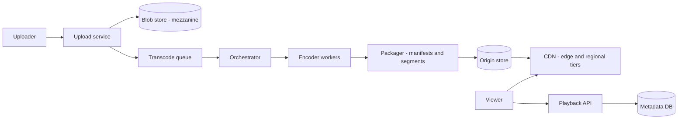

# Video Streaming Platform

## Requirements

**Functional (v1)**

- Creators upload videos (resumable, multi-GB); the platform transcodes them into an adaptive-bitrate ladder.
- Viewers stream on demand worldwide with automatic quality adaptation and resume-where-you-left-off.
- Out of scope v1: live streaming (curveball), recommendations, comments; DRM acknowledged as a packager-stage hook, not designed here.

**Non-functional**

- 50M DAU; 5M peak concurrent streams; 100K uploads/day averaging 10 minutes.
- Time-to-first-frame p90 < 2 s; rebuffer ratio < 1% of watch time.
- Upload-to-published p90 < 30 min for a 10-minute video.
- 99.9% playback availability; a published master is never lost (object storage durability, erasure coded).
- Cost reality to state up front: at this scale egress bandwidth, not compute or storage, is the dominant line item — design decisions get judged in Tbps.

## Capacity estimation

- Peak concurrency, derived not asserted: 50M DAU × ~1 h/day viewing ≈ `50M / 24 ≈ 2M` average concurrent; evening peak ≈ 2.5× ≈ **5M concurrent streams**.
- Peak egress: `5M concurrent × 5 Mbps average ladder rung = 25 Tbps`. This single number dictates the architecture: no origin serves 25 Tbps; a CDN hierarchy must absorb ≥ 99% of it.
- Session starts: 5M concurrent ÷ ~40-min average sessions ≈ `2K starts/s` peak. The playback API and manifest path are sized in thousands of RPS while segment delivery is sized in Tbps — keeping those two planes separate is the design.
- Tier absorption targets: edge hit 90% of bytes; regional tier catches 90% of edge misses (9% of total); origin sees ~1% ≈ **250 Gbps worst case** — demanding but servable from a shielded origin fleet.
- Upload volume: 100K/day × 10 min = `1M source-minutes/day`. Mezzanine at ~20 Mbps → 10 min ≈ 1.5 GB.
- Rendition storage: ladder 240p 0.3 + 360p 0.7 + 480p 1.2 + 720p 2.5 + 1080p 5 + 4K 14 ≈ **24 Mbps total** → 10 min ≈ `600 s × 24 Mb/s ≈ 1.8 GB`. Per video ≈ 3.3 GB (mezzanine + renditions) → `100K × 3.3 GB ≈ 330 TB/day ≈ 120 PB/year`; ~180 PB/year erasure-coded at 1.5×.
- Transcode compute: ~8 core-minutes per source-minute across the six rungs → `1M × 8 = 8M core-min/day ÷ 1,440 ≈ 5,600 cores` sustained; provision ~2× (≈ 12K cores) for peaks and retries — burst-friendly, spot-instance-shaped work.
- Segment arithmetic used everywhere below: 4 s segments → a 10-min video is 150 segments; a 1080p segment is `5 Mbps × 4 s / 8 ≈ 2.5 MB`.

## High-level architecture



- **Ingest:** the upload service writes the mezzanine to the blob store via resumable multipart upload, then enqueues a transcode job. Durability first; everything downstream is recomputable from the mezzanine.
- **Pipeline:** the orchestrator splits the source into segments, fans (segment × rung) encode tasks across the worker pool, and the packager assembles CMAF segments plus HLS/DASH manifests into the origin store.
- **Delivery:** viewers hit the playback API once for a signed manifest URL and stream every subsequent byte from the CDN; the origin exists to fill caches, not to serve viewers.
- The split to emphasize: a *throughput* system (pipeline, minutes matter) feeding a *latency* system (delivery, milliseconds matter), coupled only through the origin store.

## API design

```
POST /v1/videos                       // create upload session
  201: { "video_id", "upload_urls": [part1, part2, ...] }     // resumable parts

POST /v1/videos/{id}/publish          // parts complete → kick pipeline
GET  /v1/videos/{id}/status           // ingested → transcoding → ready (+ per-rung detail)

GET  /v1/videos/{id}/play
  200: { "manifest_url": "https://cdn.example.com/v/abc/master.m3u8?sig=...",
         "resume_position_s": 1284 }

POST /v1/qoe/beacons                  // async player telemetry: bitrate switches, rebuffers
```

- Manifest URLs are short-lived signed URLs: entitlement is checked once at the playback API; the CDN verifies signatures statelessly and never phones home per segment.
- Upload parts are individually retryable — a 2 GB upload over hotel Wi-Fi must survive part 137 failing.
- QoE beacons are fire-and-forget and loss-tolerant; they tune the ABR ladder offline but gate nothing in real time.

## Storage choices

- **Object store + erasure coding** for mezzanines and renditions: at 120 PB/year, EC at ~1.5× overhead versus 3× replication saves ~180 PB of raw disk per year — the dominant storage decision. Reconstruct-on-read penalties are tolerable because segments are large sequential reads, and the CDN absorbs hot traffic anyway. Mezzanines migrate to cold tier after 30 days (re-encode events are rare).
- **Metadata DB (SQL, primary + replicas):** videos ↔ renditions ↔ segments ↔ manifests is genuinely relational, joined on every publish and play; volume is trivial (100K rows/day plus children, ~500 MB/day). Boring and correct.
- **Resume positions:** Redis with async flush to a KV table — write-back, named honestly: a beacon every 10 s, cached position acked before the KV write lands, and a crash can lose the last few seconds of position. Acceptable loss, in exchange for not pointing 5M concurrent writers at the SQL primary.
- **CDN cache tiers:** edge PoP SSD/RAM sized to ~the hot 1–5% of the catalog; regional tier holds the warm long tail; the origin store is the only complete copy.
- **Small hot objects** (manifests, init segments, thumbnails, preview sprites): replicated rather than erasure-coded, and cached at edge with short TTLs — tiny bytes, huge request counts, latency-critical; the opposite profile of media segments, so the opposite policy.

## Key components & deep dives

**Transcoding pipeline — segment-parallel fan-out.**

- Probe the mezzanine → split into 150 GOP-aligned 4 s segments → emit `150 × 6 = 900` encode tasks (audio encoded once per language track, not per rung) → workers pull from the queue → validator checks duration/sync/black-frames → packager assembles per-rung playlists and the master manifest.
- Wall-clock for a 10-min video ≈ slowest single task (the 4K rung of the busiest segment, ~1–2 min) plus assembly — minutes, not the hours serial encoding would take; that parallelism is what makes the < 30 min publish SLO trivial and lets a 3-hour film publish in roughly the same wall-clock.
- Tasks are idempotent (keyed by content-hash + rung + segment index; output writes are atomic-rename), so the queue can deliver at-least-once and retries are free; stragglers get speculative re-execution; poison segments land in a DLQ with the probe metadata attached.
- Two priority lanes: fresh creator uploads outrank bulk re-encodes (codec upgrades, per-title re-runs) so a backfill campaign never delays a publish.

**CDN hierarchy and cache fill.**

- Three tiers: hundreds of edge PoPs (closest to eyeballs) → tens of regional mid-tier caches → an origin shield in front of the origin store. Each edge miss goes to its regional parent, which aggregates ~10+ edges; each regional miss goes through the shield — so concurrent misses collapse tier by tier.
- The absorption math from estimation: 90% edge + 9% regional + 1% origin turns 25 Tbps of demand into ≤ 250 Gbps of origin egress. Without the regional tier, edge misses alone (2.5 Tbps) would 10× the origin requirement — the mid-tier pays its way in one sentence.
- Request coalescing at every tier: 10K viewers hitting a cold segment in the same second produce exactly one upstream fetch per tier, with the 9,999 followers parked on the in-flight response. This plus tiering is the entire thundering-herd story.
- Admission and placement by popularity tier: hot titles pinned in edge RAM/SSD; warm tail at regional only; the 1-view long tail shouldn't evict anything — segment-level LRU with admission filters (e.g., cache on 2nd request at edge) keeps junk out.

**Adaptive bitrate — manifests and the client loop.**

- The master manifest lists the six variants; each variant playlist lists 4 s CMAF segments. The client owns adaptation: it measures per-segment download throughput (EWMA) and buffer occupancy, then picks next segment's rung — buffer < 10 s → step down aggressively (rebuffer is the cardinal sin); buffer > 20 s and throughput > 1.5× current rung → step up one.
- Startup: first segments at a conservative mid rung (480p) for a fast first frame, then climb as measurements arrive — TTFF < 2 s needs manifest + init segment + first media segment inside the budget, helped by prefetching manifest and init segment on hover/browse.
- Why 4 s segments: adaptation can only happen at segment boundaries, so shorter = faster reaction and lower startup, but more requests, more manifest churn, and worse encode efficiency (more keyframes). 2 s suits latency-critical content; 8–10 s wastes adaptation agility for marginal compression; 4 s is the defended midpoint for VOD.
- Server-side knobs stay coarse on purpose (rung caps under incident, default startup rung); per-session adaptation belongs in the client, which alone sees its own buffer and radio conditions.
- The QoE beacons close the loop offline: per-region and per-ASN rebuffer/switch rates tune the default startup rung and ladder caps — measured, not guessed.

**Hot content — premieres and the long tail.**

- Default cache fill is pull (cache on miss): self-tuning, zero coordination, right for the entire unpredictable catalog.
- The exception is the predictable premiere: a flagship episode dropping at 9 pm is push territory — pre-position its segments to edge tiers in the preceding hours, because letting 2M concurrent first-second viewers warm caches organically means the first wave eats regional+origin latency en masse.
- Per-title popularity tiering drives placement continuously: a small head of titles dominates bytes served; demote aggressively as titles cool. The premiere is just a title entering the head with zero observed history — push is a manual override of the popularity signal.

## Common tradeoffs

**HLS vs DASH.**

- HLS: native on Apple devices (the only option for iOS Safari), the broadest legacy device support, the safest single choice.
- DASH, steel-manned: an open codec-agnostic standard, cleaner multi-DRM story (CENC), no platform owner steering it; on pure technical merit it is at least HLS's equal.
- CMAF dissolves most of the dilemma: encode and store one set of fragmented-MP4 segments, emit both an `.m3u8` and an `.mpd` manifest over the same bytes. Cost of "both" ≈ manifest generation + a wider player test matrix; storage is not duplicated. Choose CMAF + both manifests; choose HLS-only when the device matrix is small and engineering is scarce.

**Erasure coding vs replication for video bytes.**

- 3× replication: fastest reads (any replica serves whole blocks), simplest repair, no decode CPU; 3× the disk on 120 PB/year ≈ 360 PB/year raw.
- EC ~1.5× (chosen): halves the disk bill at the cost of reconstruct-on-failure reads, repair traffic that touches many nodes, and higher tail latency on degraded reads.
- The workload decides: large, sequential, CDN-shielded segments are EC's best case. Keep small hot objects — manifests, init segments — replicated; they're tiny and latency-critical. Mixed policy, stated explicitly.

**Per-title encoding vs a fixed ladder.**

- Fixed ladder: one config, predictable costs, every video pays the same bitrate whether it's a chess lecture or an action film.
- Per-title (complexity-analyzed ladders): +20–50% encode compute and pipeline complexity to cut 10–30% bitrate at equal quality. At 25 Tbps egress, even 15% is ~4 Tbps of CDN spend — compute (5,600 cores) is rounding error against that.
- Steel-man the fixed ladder where it wins: small catalogs, or tails where a video's lifetime views never repay its analysis pass. Decision rule: apply per-title above a popularity threshold; the head pays for itself within days.

**Segment duration — 2 s vs 4 s vs 8 s.**

- 2 s: fastest startup and adaptation, the choice for low-latency modes; 2× the requests and manifest entries, worse compression (keyframe density), more CDN object overhead.
- 8 s: best compression and fewest requests; adaptation reacts a full 8 s late — an eternity on a degrading cellular link — and startup must download a bigger first chunk.
- 4 s (chosen for VOD): the knee of the curve. Present it as a measured spectrum, not a constant handed down.

## Curveballs interviewers throw

1. **"Season finale: 2M concurrent on one title at minute zero."** Pre-positioned segments at every edge tier (push override, hours earlier); request coalescing handles the cold spots; manifest requests — small, identical, cache briefly — are the sneaky hot object, so edge-cache them with a short TTL. Viewers also arrive staggered by player startup jitter, which smooths the first-second spike. The failure to avoid: 2M misses racing through regional to origin — exactly what coalescing + pre-warm exist to prevent.
2. **"A whole regional CDN tier goes down."** Its edges re-parent to a neighbor region's tier (DNS/anycast steering), adding ~30–60 ms fill latency — invisible behind client buffers; the origin shield absorbs the temporary fill spike. Incident lever if egress runs hot: cap the top rung (4K → 1080p) fleet-wide, instantly shedding up to ~40% of bytes depending on how much of your traffic is 4K, with graceful quality loss instead of rebuffering. Have that lever pre-built; inventing it mid-incident is too late.
3. **"Creators demand publish in under 2 minutes."** The pipeline is already segment-parallel, so attack the critical path: publish progressively — go live with 480p as soon as that rung completes (~tens of seconds), append higher rungs to the manifest as they finish. ABR clients pick up new variants on manifest refresh naturally. Costs honesty in UX ("HD processing…") and early viewers capped at 480p; far better than holding publish hostage to the 4K rung.
4. **"Copyright scanning without delaying publish."** Fingerprint (audio + video hashes) in parallel with transcode, gating nothing by default: high-confidence matches against the claims DB block at the publish gate (which fingerprinting beats — it reads the mezzanine, not the renditions); everything else publishes and the async claim pipeline handles takedowns/monetization after the fact. Risk-tiered gating (new accounts, known-abuse patterns get synchronous review) balances legal exposure against creator latency.
5. **"Now do live."** Be explicit about what transfers and what dies. Dies: segment-parallel encoding (a live frame can't be parallelized into the future — one real-time encoder chain per rung), pre-positioning (no future to pre-warm), the 30-min publish budget. Transfers: CDN hierarchy, coalescing, manifests/ABR — with shorter (2 s / partial) segments and rolling manifest windows, latency floor ≈ segment length × buffer depth. Live is a different system sharing the delivery half; saying so beats pretending the pipeline stretches.
