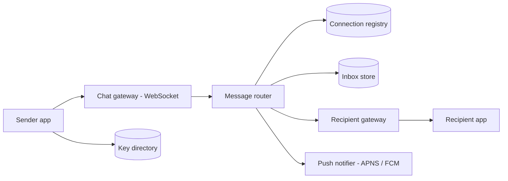

# WhatsApp-Style Chat

## Requirements

**Functional (v1)**

- 1:1 text messaging with sent / delivered / read states.
- Group chats up to 1,024 members.
- Offline delivery: messages sent while the recipient is offline arrive when they reconnect.
- End-to-end encryption: the server relays and briefly stores ciphertext it cannot read.
- Out of scope for v1: voice/video calls, stories, multi-device (taken as a curveball), media pipelines (stub: blob store + CDN, message carries a pointer).

**Non-functional**

- ~1B DAU, ~50B messages/day, ~250M peak concurrent connections.
- Online delivery p95 < 500 ms sender-to-recipient.
- An acknowledged message is never lost — durability before the server ack, no exceptions.
- Per-conversation ordering (global ordering is neither needed nor claimed).
- Send availability 99.99%: people check the checkmark; failures must be visible, not silent.

The honest framing to open with: the network will duplicate and drop things, so the contract is at-least-once on the wire, effectively-once at the UI via msg_id dedup. True exactly-once delivery over a lossy network is impossible — say this before the interviewer makes you say it.

## Capacity estimation

- Message throughput: `50B / day ≈ 600K msg/s` average (1B/day ≈ 12K/s × 50), peak ≈ 2.5× ≈ **1.5M msg/s**.
- Payloads: ~200 B ciphertext + ~100 B envelope ≈ 300 B → peak ingress `1.5M × 300 B ≈ 450 MB/s ≈ 3.6 Gbps` fleet-wide. Bandwidth is trivial; **connection count is the scaling problem**.
- Connections: 250M concurrent ÷ ~1M conns per gateway box (epoll + ~20 KB memory per mostly-idle conn ≈ 20 GB + headroom) → ~250 gateways; run ~350 for deploys and failure slack.
- Connection registry: 250M entries × ~50 B = **12.5 GB** — one Redis cluster.
- Inbox (offline) store: ~15% of messages land offline (`7.5B/day`), median residence ~6 h → steady state ≈ `7.5B × 0.25 day × 300 B ≈ 560 GB`. Tiny, because delivered messages are deleted.
- Inbox write load: groups amplify — 80% 1:1 (40B writes/day) + 20% group × ~10 recipients (100B writes/day) = `140B inbox writes/day ≈ 1.7M/s` average, ~4M/s peak. Small LSM writes spread over a ~100-node cluster.
- Push-notification wakes: the ~15% offline share means `7.5B/day ≈ 90K/s` average APNS/FCM sends — and the router must collapse per device (40 queued messages wake the phone once, not 40 times).

## High-level architecture



- Clients hold one long-lived WebSocket to a **chat gateway**; gateways are dumb pipes that own sockets and heartbeats.
- The **message router** is the brain: persist to the recipient's **inbox store** first (the durability point — only then ack the sender), look up the recipient's gateway in the **connection registry**, and push. Offline or push fails → the message waits in the inbox and the **push notifier** raps on the app's door via APNS/FCM.
- Delivered-and-acked messages are deleted from the inbox: the server is a store-and-forward relay for ciphertext, not an archive.
- The **key directory** serves public identity keys and one-time prekeys for session setup; the server never holds private keys.

## API design

WebSocket frames after auth (the hot path):

```
send:     { client_msg_id, chat_id, ciphertext, ts }            // client → server
ack:      { client_msg_id, server_msg_id, seq }                 // server → client
deliver:  { server_msg_id, chat_id, ciphertext, seq }           // server → recipient
recv_ack: { server_msg_id }                                     // recipient → server
receipt:  { type: delivered | read, chat_id, up_to_seq }        // both directions
```

HTTP for the cold path:

```
POST /v1/keys/prekeys             // upload a batch of one-time prekeys
GET  /v1/keys/{user_id}           // fetch prekey bundle to start a session (atomic pop)
POST /v1/groups {member_ids}      // create group; membership changes are control messages
POST /v1/media/upload-url         // signed blob-store URL; message carries the pointer
```

- `client_msg_id` is generated on-device and is the idempotency key for the whole pipeline.
- Receipts are cumulative (`up_to_seq`), not per-message — one frame can acknowledge a hundred messages, which matters at 600K msg/s.

## Storage choices

- **Inbox store:** wide-column LSM, partitioned by recipient_id, clustered by seq; rows deleted on delivery ack (TTL 30 days as backstop). Chosen CP per partition: if a recipient's inbox shard is unreachable, sends to them error/time out and the sender retries — a visible failure beats a silently dropped message. Fast failover (leader election per shard) keeps the blast radius to seconds.
- **Connection registry:** Redis `user_id → {gateway_id, device_id, epoch, last_seen}`. Deliberately AP: a possibly stale routing entry just means one failed push RPC, after which the message rides the inbox + push-notification path. Never make routing lookups block on consistency.
- **Key directory:** SQL — small, relational (users × devices × prekeys), and prekey handout must be atomic (each one-time prekey handed to exactly one requester: single-row delete-returning).
- **No long-term message archive.** E2EE makes server-side history near-useless (ciphertext, no search) and it 1000×s the storage bill. History lives on devices; the tradeoff against Slack/Telegram-style server history is steel-manned below.

## Key components & deep dives

**Connection registry and routing.**

- On connect: authenticate, write `user → (gateway, epoch)` to the registry; heartbeat every ~30 s gateway-local (250M × 1/30 s ≈ 8.3M pings/s never leave their gateways); on disconnect, delete the entry.
- Routing a message: router looks up the recipient's gateway, RPCs it, gateway writes to the socket. Registry hit but dead socket (crashed gateway, stale entry): the RPC fails fast, the router falls back to push notification — the message is already safe in the inbox, so routing failures cost latency, never data.
- The `epoch` field breaks split-brain: a reconnect to gateway B writes a higher epoch, so a zombie entry pointing at gateway A loses CAS races and late writes from A are rejected.

**Delivery guarantees — the ack ladder.**

- Step 1: client sends with `client_msg_id`, retries on timeout until the server ack arrives — at-least-once from device to server.
- Step 2: the router persists to the recipient inbox **before** acking the sender. The ack is a durability receipt, not a delivery receipt — one checkmark means "the system owns it now".
- Step 3: server pushes to the recipient and retries until `recv_ack` — at-least-once from server to device; only then is the inbox row deleted.
- Step 4: both ends dedup by msg_id (a per-chat window of recent ids); the seq from the chat's home partition gives per-conversation total order, and gaps in seq tell a reconnecting client exactly what to fetch.
- Reconnect uses the same machinery: the client reports its highest contiguous seq per chat; the server replays everything above it from the inbox — seq doubles as ordering and resume cursor, no separate sync protocol.
- Net effect: at-least-once on the wire at every hop, effectively-once at the UI via msg_id dedup. Duplicates exist in the pipes; the user never sees one.

**Group fan-out with sender keys.**

- Naive E2EE for a 1,024-member group: the phone encrypts the message 1,023 times pairwise and uploads 1,023 ciphertexts (~300 KB and 1,023 ratchet steps per message) — battery and upstream bandwidth die first.
- Sender keys: on join, each member generates a sender key and distributes it once to each peer through the existing pairwise E2EE sessions (N−1 setup messages, one time). Each message thereafter: **one** symmetric encryption, **one** upload; the server fans the same ciphertext out to ≤ 1,024 inboxes — server-side fan-out of bytes it cannot read.
- The bill comes due on membership change: removing a member requires every remaining member to rotate and redistribute sender keys (the removed member held everyone's keys). Joins are cheap (new member gets keys; old messages stay sealed — forward secrecy preserved by ratcheting the sender key per message).
- Group ordering: the group's home partition assigns seq, so all members agree on order without any client coordination.

**Receipts and presence without melting the system.**

- Delivered/read receipts are tiny messages riding the same pipeline, and they roughly double message volume — which is why they're cumulative (`up_to_seq`) and batched client-side (one receipt frame per chat per few seconds).
- Receipts are naturally idempotent (a replayed "read up to seq 142" is a no-op), so at-least-once delivery needs no extra machinery.
- Presence (online / last-seen) is the write-amplification trap: naive broadcast on every state flap is O(contacts) per flap. Throttle transitions (≥ 60 s granularity) and pull presence lazily when a chat is opened, pushing live updates only for currently-open conversations.
- Typing indicators are the far end of the same spectrum: pure ephemera — sent over the socket only if both parties are online in that chat, never persisted, never retried. Not every frame deserves the inbox treatment; sorting frames by contract is the skill on display.

## Common tradeoffs

**Store-and-delete vs permanent server history.**

- Server history (Slack/Telegram model): new-device backfill and multi-device sync are trivial, server-side search works, message recall is consistent. The price: an archive measured in petabytes (50B msgs/day × 300 B ≈ 15 TB/day forever), and a breach/subpoena surface containing every conversation — plus E2EE reduces it to unsearchable ciphertext anyway.
- Store-and-delete (chosen, given the E2EE requirement): the server holds ≈ 560 GB of in-flight ciphertext; the threat model is honest ("we cannot read or produce your history"); device loss without a client-side backup genuinely loses history — that is the real, user-visible cost. Accept it knowingly.

**WebSocket push vs long-polling.**

- Long-polling: stateless servers, plain HTTP, every cache/LB in the world understands it. At messaging scale the constants betray it: 250M clients re-establishing requests, per-message TLS+header overhead dwarfing 300 B payloads, and battery cost from radio wake-ups.
- Persistent WebSocket (chosen): one TLS handshake, ~zero per-message overhead, server can push instantly; the bill is 250M live sockets of state, sticky routing, and a reconnect-storm story you must design (curveball 3). Freshness is the product, so pay the state bill.

**Sender keys vs pairwise encryption for groups.**

- Pairwise everywhere: simplest possible key model, and member removal is free — just stop encrypting to them. For groups ≤ ~10 it is genuinely fine.
- Sender keys (chosen at 1,024): O(1) sender work per message vs O(N); the costs are rotation storms on removal and more complex session state. The crossover is where typing one message costs more battery than the screen — small groups don't care, 1,024-member groups absolutely do.

**Inbox CP vs AP.**

- AP inbox (accept the write on any reachable replica): sends never visibly fail; during a partition, replicas diverge — a recipient may read a possibly stale inbox missing messages that were acked, the one lie this product must never tell.
- CP inbox (chosen): during a partition the minority side errors/times out, the sender sees a clock icon and the client retries — failure is visible and bounded by shard failover (seconds). For chat, "definitely sent or visibly pending" beats "always accepted, maybe missing".

## Curveballs interviewers throw

1. **"A user returns after 30 days offline to 40K queued messages."** Don't firehose the socket. Backfill in pages (oldest-first per chat, so ordering and dedup windows hold), client acks page by page, inbox rows deleted as pages land; APNS collapses to one "you have messages" notification rather than 40K. Beyond the 30-day inbox TTL, be honest in-product about truncation.
2. **"Make groups 100K members."** Sender-key rotation breaks first: one member removal = 100K members re-keying ≈ 100K × 100K key messages fleet-wide. At that size it's no longer a group, it's a channel: one-to-many broadcast, fan-out-on-read from a channel log (members pull on open), relaxed or asymmetric encryption, and per-member rate limits. Resist scaling the group machinery; change the abstraction.
3. **"A gateway with 1M connections dies."** 1M clients reconnect at once. Client-side jittered exponential backoff is baked into the protocol; LBs apply connection-admission rate limits so the herd spreads over ~30 s; registry writes (tiny) absorb the surge; messages sent meanwhile follow the inbox + push path, so nothing is lost — the incident costs seconds of latency, not data.
4. **"Add multi-device."** Each device gets its own E2EE session and its own inbox queue; senders encrypt per recipient *device* (or per-device sender keys in groups); read receipts aggregate across devices (read anywhere = read). The subtle attack: a silently added "ghost device" can intercept — so the device list is itself signed and versioned, and clients surface device-list changes in the UI.
5. **"Implement delete-for-everyone."** It's a control message through the same pipeline referencing the target msg_id; recipients' apps honor it by redacting locally. Be straight about the limits: already-read content was seen, offline devices apply it on reconnect, and a hostile client can ignore it. Bound the feature (e.g., within 1 h of send) and frame it as best-effort courtesy, not a security guarantee.
